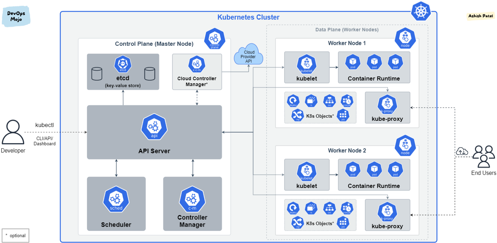

## Kubernetes

An open-source system for automating deployment, scaling, and management of containerized applications (cloud-native microservices apps) across a cluster of machines. Platform is designed to completely manage the lifecycle of applications and services using API/CLI methods that provide predictability, scalability and high availability. Containers are executed in Docker.

As a Kubernetes user, you can define how your applications run i.e. scaling services up/down, performing graceful rolling updates, switching traffic between different versions, or rollback problematic deployments.

### Cloud-native

A cloud-native application is one that's designed to meet cloud-like demands of auto-scaling, self-healing, rolling updates, rollbacks, etc. Though cloud-native apps can absolutely run in the public cloud, they can also run in on-premises datacenter. Instead, cloud-native is about the way applications **behave and react to events**.

Kubernetes abstract cloud resources and schedules application microservices.

### Kubernetes vs Docker

Docker is relatively low-level and relies on CLI that interact with one container at a time. Kubernetes provides much higher-level abstractions for defining applications and their infrastructure using declarative schemas.

### Features

- Automated rollouts, scaling and rollbacks
- Service discovery, load balancing, and network ingress
- Stateless and stateful applications
- Storage management with persistent storage
- Declarative state
- Works across environments including AWS/GCP
- Highly extensible including custom object types, controllers, and operators

### Distributions

Cloud or self-managed including Docker Enterprise, Rancher, OpenShift, Canonical, VMWare PKS.

## Architecture

Kubernetes deployment is called a cluster that consists of at least one control plane and one or more nodes. Both control planes and node instances can be physical devices, VMs or instances in the cloud.

### Abstraction Layers

When kubectl create, it creates the Deployment controller -> Replicaset -> Pod. Replicaset is to ensure two pods are running with identical template. Deployment's job is to manage the Replicaset configuration.

### Imperative vs Declarative

- Imperative refers to how a program operates, Declarative focuses on what it should accomplish (end state)
- RUN, CREATE, UPDATE are Imperative
- -Middle ground is using Imperative objects such as create -f file.yml
- APPLY is Declarative; requires understanding of YAML keys and values and easiest to automate
- Overall, don't mix three approaches

## Storage/Volume

Orchestration was initially designed around containers being immutable; having storage/stateful workloads will add complexity to the system. StatefulSets is a new resource type that makes Pods more sticky. Volumes are tied to the lifecycle of a Pod; all containers in single Pod can share them. PersistentVolumes is created at cluster level and outlives a Pod. For third-party storage, Container Storage Interface (CSI) plugins are used to connect to them.

## Ingress

None of Service types work at OSI Layer 7 (HTTP). For multiple sites sharing same ports i.e. 80, Ingress Controllers help to route outside connections based on hostname or URL to different containers. Vendors that make the controllers include Nginx, Traefik, HAProxy, F5, Envoy, Istio, etc.

## Higher Deployment Abstractions

Helm is the de facto that everyone looks to for creating templates and using templating YAML standards for deploying third-party apps. However, there are over 60 third-party tools to do this. For Docker, can use compose yaml to deploy on Kubernetes.
