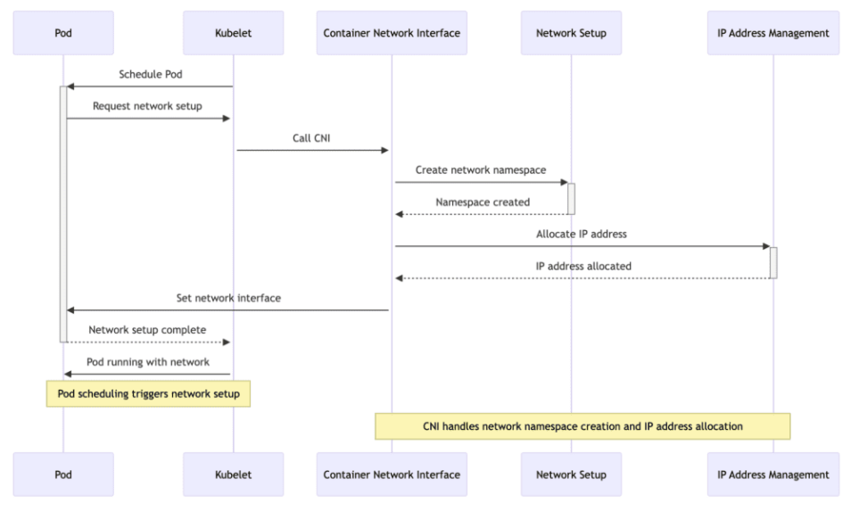
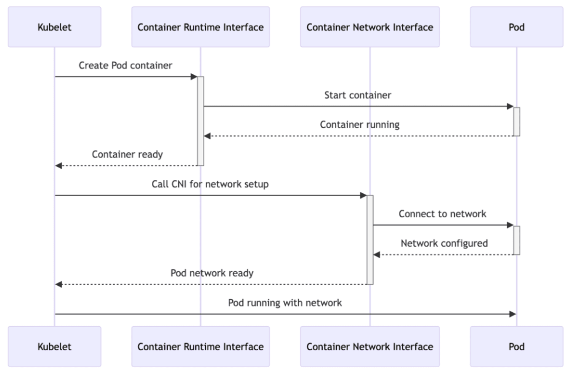

## Container Network Interface (CNI)

The CNI specification provides a common interface between container runtimes (containerd, CRI-O, Podman) and network plugins (Flannel, Calico, Weave Net, Cilium), aiming to standardize container network configuration. CNI can be used to configure both overlay and underlay networks.

CNI plugins are responsible for providing connectivity by assigning IP addresses to Pods and Services, and reachability through its routing daemon.

The CNI specification comprises several core components:

- Network configuration format: Defines how administrators define network configurations
- Request protocol: Describes how container runtimes send network configuration or cleanup requests to network plugins
- Plugin execution process: Details how plugins execute network setup or cleanup based on the provided configuration
- Plugin delegation: Allows plugins to delegate specific functionalities to other plugins
- Result return: Defines the data format for returning results to the runtime after plugin execution

By defining these core components, the CNI specification ensures that different container runtimes and network plugins can interact in a consistent manner, enabling automation and standardization of network configuration.

### How CNI plugin works

1. When a Pod is created, the container runtime invokes the configured CNI plugin to setup networking
2. CNI plugin receives information about the Pod's network requirements and assigns an IP address to the Pod
3. CNI plugin configures a network interface (veth) in the Pod's container with the assigned IP address, and sets up the necessary routing rules and network policies

### CNI and CRI relationship

CRI invokes CNI plugins to configure or clean up container networks, ensuring tight coordination between the network configuration process and container creation and destruction processes.

