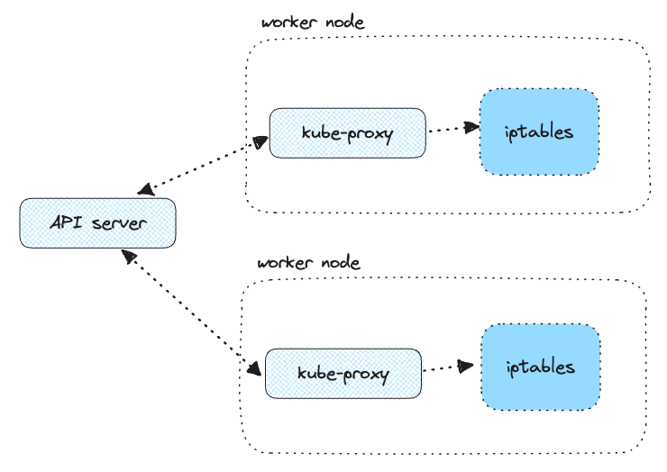

## kube-proxy

In Kubernetes, the ephemeral nature of Pods means their IP addresses can change, making it challenging to establish stable connections. This is where the Service object comes into play. Services provide a **consistent IP address** to access Pods and are linked to a group of Pods. When traffic arrives at a Service, it is intelligently directed to the relevant backend Pods.

Kube-Proxy is a network proxy that runs on each node in a Kubernetes cluster. It is responsible for maintaining network connectivity between services and pods. Kube-Proxy does this by translating service definitions into actionable networking rules.

### How it works

Once Kube-Proxy is installed, it establishes authentication with the API server. As new Services or endpoints are introduced or removed, the API server promptly communicates these changes to Kube-Proxy.

Kube-Proxy takes these updates and translates them into NAT rules within the node. These NAT rules are essentially mappings, linking Service IP addresses to Pod IP addresses.

The process is as follows:

1. A service with clusterIP is created
2. API server examines which Pods to associate with the service by matching labels to the Service's label selector
3. API server creates an endpoint representing the IP address of each Pod
4. API server solidifies the connection between Service and endpoints by mapping the IP address of Service to the IP addresses of Pods
5. API server advertises updates to the kube-proxy

## Load balancing

### IPtables

This is the default and widely used mode. Kube-Proxy relies on IPtables, a Linux feature for packet processing and filtering. In this mode, Kube-Proxy inserts Service-to-Pod NAT rules (provided by CNI plugins) into IPtables, redirecting traffic from Service IP to Pod IP.

In this mode, kube-proxy **watches for changes in the API Server**. For each new Service, or when Pods get created or destroyed, it installs iptables rules, which capture traffic to the Service's clusterIP and port, then redirects traffic to the backend Pod for the Service. The Pod is selected randomly. This mode is reliable and has a lower system overhead because Linux Netfilter handles traffic without the need to switch between userspace and kernel space.

When we send packets from a Pod to the Service IP, they get filtered through the iptables rules, where the destination IP (Service IP) gets changed to one of the backing Pod IPs.

On the way back (from the destination Pod to the source Pod), the destination Pod IP gets changed back to the Service IP, so the source Pod thinks it's receiving the response from the Service IP.

### IPVS

IPVS is built on top of Netfilter and implements transport-layer load balancing. IPVS uses the Netfilter hook function, using the hash table as the underlying data structure, and works in the kernel space. This means that kube-proxy in IPVS mode redirects traffic with lower latency, higher throughput, and better performance than kube-proxy in iptables mode.
