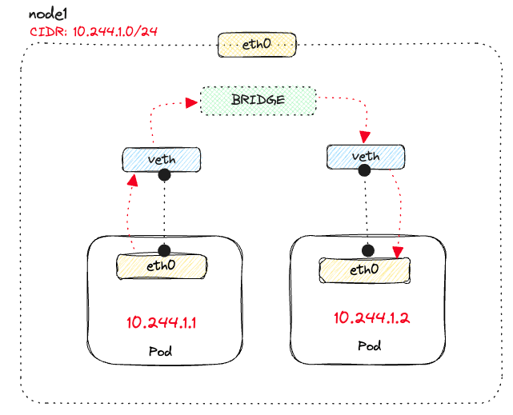
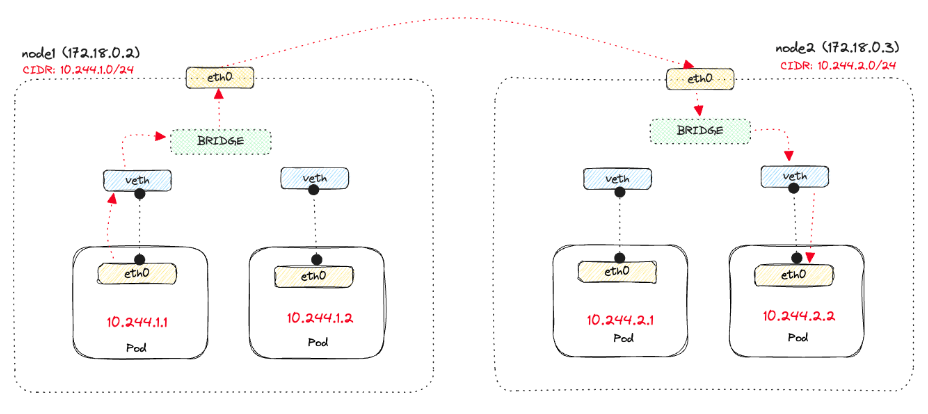

## Networking

Kubernetes was created to run distributed systems with a network plane spread across a cluster of machines. In addition to providing inter-connectivity between components, Kubernetes cluster networking creates a seamless environment where data can move freely and efficiently through software-defined networking.

Kubernetes provides networking for containerized applications with a **flat network structure**, and each Pod is fully routable on an internal Kubernetes network called **pod network**.. This eliminates the need to map host ports to container ports, enabling the operation of a distributed system without dynamic port allocation.

Requires the network implementation to treat pods as 'real' IP addresses, available from the host network. Every application can then listen on any port they want without fear of conflicts.

As a default configuration, the Pod network is wide open and you should use **Network Policies** to lock down access.

### Networking model

The Kubernetes networking model specifies:

- Every Pod gets its own IP address
- Containers within a Pod share the Pod IP address and can communicate freely with each other
- Pods can communicate with all other Pods in the cluster using Pod IP addresses without NAT
- Agents on a node (kubelet, kube-proxy) can communicate with all pods on that specific node

## Communication

### Container-to-container

Pods solve container-to-container communication in Kubernetes through the **network namespaces**. Every pod has its network namespace, IP address, and port space.

The containers within the pod (the network namespace) can communicate through localhost and share the same IP address and ports. The "network namespaces" in Linux allow us to have separate network interfaces and routing tables from the rest of the system.

### Pod-to-pod

The nodes in the cluster have their IP address and a CIDR range from where they can assign IP addresses to the pods. The pod-to-pod communication happens through these IP addresses. When a new Pod is created, the IP addresses never overlap. Pod-to-Pod communication happens using **real IPs**, whether you deploy the Pod on the same node or a different node in the cluster.

For Pods to communicate with each other, the traffic must flow between the Pod network namespace and the Root network namespace, which is achieved by a virtual ethernet device or a veth pair. A virtual network bridge connects these veths, allowing traffic to flow between them using the Address Resolution Protocol (ARP).



For pod-to-pod communication across nodes, **CNI plugins are required**. CNI plugin runs a daemonset that is responsible for setting up the bridge between nodes and allows one pod to call another pod using an IP address.

```
# routing table for node1

default via 172.18.0.1 dev eth0
10.244.0.0/24 via 172.18.0.4 dev eth0
10.244.2.0/24 via 172.18.0.3 dev eth0  # send to node2
10.244.1.1 dev veth2609878b scope host
10.244.1.1 dev veth23974a9d scope host
172.18.0.0/16 dev eth0 proto kernel scope link src 172.18.0.2
```



### Pod-to-service

While Pod IP addresses are unique, they will change whenever the Pods get re-created. The transient nature of Pods means we can't rely on the Pod IPs and need a durable IP address. Kubernetes solves this problem using the concept of a Kubernetes Service:

1. A static virtual IP address is assigned in the frontend Service that connects any backend Pods associated with it
2. Service load-balances any traffic addressed to its virtual IP to the backend Pods
3. Service keeps track of IP address changes

When traffic is sent to the service IP, it gets routed to one of the backing Pod IPs. This is solved by kube-proxy using IPtables or IPVS (IP virtual server).

### Ingress and egress

Ingress and egress deals with communication exiting and entering the cluster.

For egress, the iptables ensure the source IP of the Pod gets modified to the internal IP address of the node (VM) through **SNAT**.

Typically, when running a cloud-hosted cluster, the nodes have private IPs and run inside a virtual private cloud network (VPC). We need to attach an internet gateway to the VPC network to allow the nodes access to the internet. The gateway performs network address translation (NAT) and changes the internal node IP to the public node IP. NAT allows the response from the internet to be routed back to the node and eventually to the original caller. On the way back, identical translations happen, but in the reverse order.

For ingress, we need a public IP address to get outside traffic inside the cluster. A Kubernetes LoadBalancer service allows us to get an external IP address.

When the traffic arrives at the LB, it gets routed to one of the nodes in the cluster. Then, the iptables rules on the chosen node kick in, do the necessary NAT, and direct the packets to one of the pods that's part of the service.

However, we don't want to create a LoadBalancer instance of every service we want to expose. Ideally, we'd have a single external IP address and the ability to serve multiple Kubernetes services behind that.

We can use the ingress resource and a backing ingress controller i.e. nginx-ingress. **The ingress controller is a Pod that runs in the cluster and watches for changes to the ingress resource**.

When we create a new ingress resource, the ingress controller creates the necessary rules to route the traffic to the correct service. The traffic goes from the LB to the ingress controller, which then routes the traffic to the proper service.

## Communication components

### kube-proxy

- kube-proxy is a network proxy and load balancer running on each Node
- Handles service-based communication within the cluster
- Maintains a set of network rules and ensures that traffic is correctly forwarded to the appropriate destination
- Supports different proxy modes i.e. userspace, iptables, IPVS

### Service Discovery

- Kubernetes offers a built-in service discovery mechanism that allows containers to locate other containers/services
- Kubernetes DNS service automatically assigns a DNS name to each service, making it discoverable by other containers within the cluster
