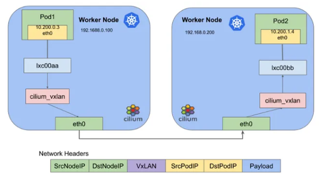

## Node Networking Models

Kubernetes support various networking models that determine how nodes communicate with each other.

### Overlay

- Overlays a logical Layer 2 network over an existing Layer 3 network topology
- Each Node has its own private network
- Containers within a Node communicate over this private network
- Containers across Nodes communicate over an overlay network
- Overlay networks encapsulate packets and route them between nodes using an overlay network driver (VXLAN, Flannel)
- It relies on UDP ports to disseminate encapsulation data among Kubernetes workers, creating a bridge connecting these workers and pods

### Underlay

- Does not introduce an isolated Layer 2 network
- Utilizes BGP to efficiently propagate routing information to Pods
- Communication is overseen by container engine
- All Nodes share a single flat network
- Each Node has a unique IP address within this network
- Containers communicate with each other using the Node's IP address and port mapping
