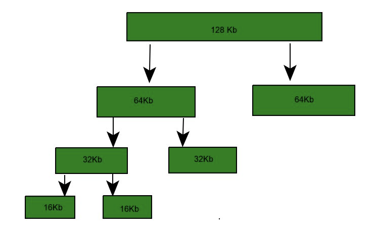
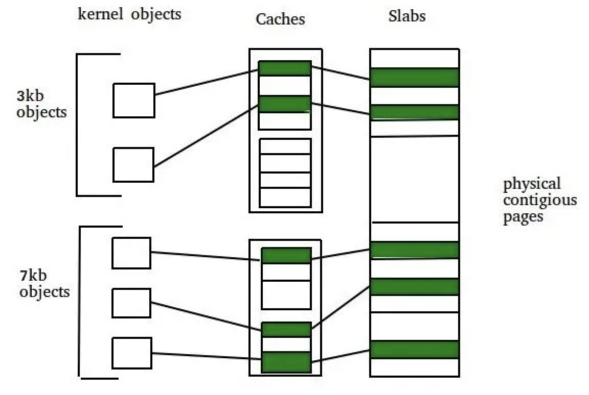
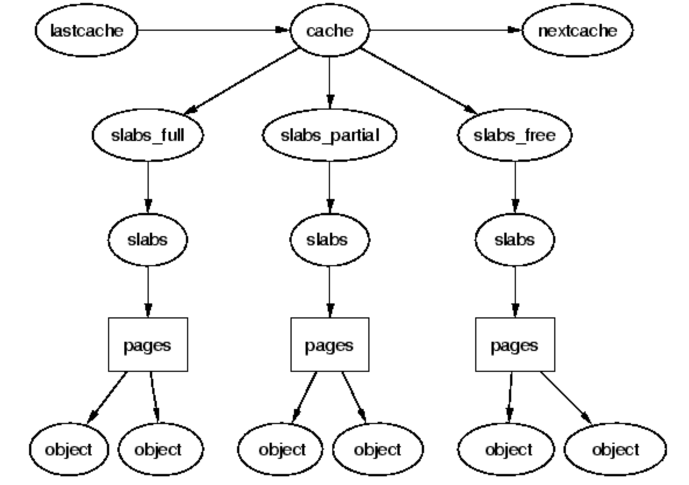

## Memory management

The Linux kernel offers two mechanisms for allocating memory, both of which are built on top of the kernel's page allocator:

- **Slab allocator (kmalloc())**: Obtains physically contiguous memory in the kernel's own address space; typically assessed via kmalloc()
- **Buddy allocator (vmalloc())**: Returns memory in a separate address space; that memory will be virtually contiguous but may be physically scattered

As a general rule, slab allocations are preferred for all but the largest of allocations. The slab allocator works best with allocations that are **less than one physical page in size** (vmalloc() can only allocate entire page).

## Buddy allocator

The buddy system is a memory allocation algorithm that works by dividing memory into blocks of a fixed size, with each block being a power of two in size.

### How it works

1. When a request for memory is made, the algorithm finds the smallest available block of memory that is large enough to satisfy the request
2. If the block is larger than the requested size, it is split into two smaller blocks of equal size (the “buddies”), with each buddy being marked as either allocated or free
3. The algorithm then continues recursively until it finds the exact size of the requested memory or a block that is the smallest possible size

### Challenges

Although the buddy system is easy to implement and can handle a wide range of memory sizes, it can lead to **memory fragmentation**, and can be inefficient for allocating small amounts of memory.

## Slab allocator

The slab system is a memory allocation algorithm that is designed specifically for kernel memory. It works by dividing memory into fixed-size caches or slabs, each of which contains a set of objects of the same type.

The slab allocator supports dynamic memory allocation for the kernel. It is aware of concepts such as object size, page size, and total cache size. Hence, it can make more intelligent decisions.

The slab allocator has three principle aims:

- The allocation of small blocks of memory to help eliminate internal fragmentation that would be otherwise caused by the buddy system
- The caching of commonly used objects so that the system does not waste time allocating, initializing and destroying objects
- The better utilization of hardware cache by aligning objects to the L1 or L2 caches

The key feature of the slab allocator mechanism is to release objects after use but keep them cached without immediately destroying them. This allows the allocation to be ready to be reused by an object of the same type.

### Why need it?

The kernel needs many different temporary objects e.g. dentry, mm_struct, inode, file_struct structures. They can vary in size, and are often allocated and often freed; hence, these operations need to be performed efficiently.

Kernels require a memory allocator under the page level. While pages serve as the standard unit for memory operations, there are kernel data structures smaller than a page.

When memory gets fragmented, groups of physically contiguous pages can get hard to find, and system performance can suffer as the allocator struggles to create such groups.

The core idea behind the “slab allocator” is to ensure a **page holds only data structures of the same kind**, thus **eliminating external fragmentation**.

### Slab allocation

The basic idea behind the slab allocator is to have caches of commonly used objects kept in an initialised state available for use by the kernel. Without an object based allocator, the kernel will spend much of its time allocating, initialising and freeing the same object. The slab allocator aims to cache the freed object so that the basic structure is preserved between uses.

The slab allocator consists of a variable number of caches that are linked together on a doubly linked circular list called a cache chain. For frequently used objects e.g. files_struct, it maintains a **dedicated cache**, and for other objects a number of **generic caches**, one for each area of size being the next power of two.

Two key terms in slab allocation are:

- **Slab**: Made up of a contiguous portion of memory of fixed size i.e. one or more physically contiguous pages. The slab is the actual container of data associated with objects of the specific kind of the containing cache
- **Cache**: Represents a small amount of very fast memory. A cache consists of one or more slabs. There is a single cache for each unique kernel data structure i.e. each cache represents a pre-allocated memory space dedicated to a specific data type

### Operations

A slab may be in one of three possible states:

- **Full**: All objects in the slab are marked as used
- **Empty**: All objects in the slab are marked as free
- **Partial**: The slab consists of both

During the object allocation phase, it checks whether free memory blocks already exist (partial slabs); if such blocks are available, they are occupied. Otherwise, a new allocation is created (empty slab).

By tracking free blocks and adopting a method of recycling blocks, the slab allocator greatly reduces memory fragmentation.

### Class approach

For a slab class approach:

1. When a user requests memory allocation, the library searches the arena for a slab class that can meet the request
2. If none is found, a new class is created with the chunk size being equal to or larger than the requested size
3. The requested allocation size must be smaller than the slab size, set when the arena is established

### Implementation

The slab allocation algorithm uses caches to store kernel objects. When a cache is created a number of objects which are initially marked as free are allocated to the cache. The number of objects in the cache depends on size of the associated slab.

For example, a 12 kb slab (made up of three contiguous 4 kb pages) could store six 2 kb objects. Initially all objects in the cache are marked as free. When a new object for a kernel data structure is needed, the allocator can assign any free object from the cache to satisfy the request. The object assigned from the cache is marked as used.

### Content

Content can be found in `/proc/slabinfo`:

- active_objs: Number of objects that are currently active
- num_objs: Total number of allocated objects
- object_size: Size of objects in this slab, in bytes
- objsperslab: Number of objects stored in each slab
- pagesperslab: Number of pages allocated for each slab
- active_slabs: Number of active slabs
- num_slabs: Total number of slabs
