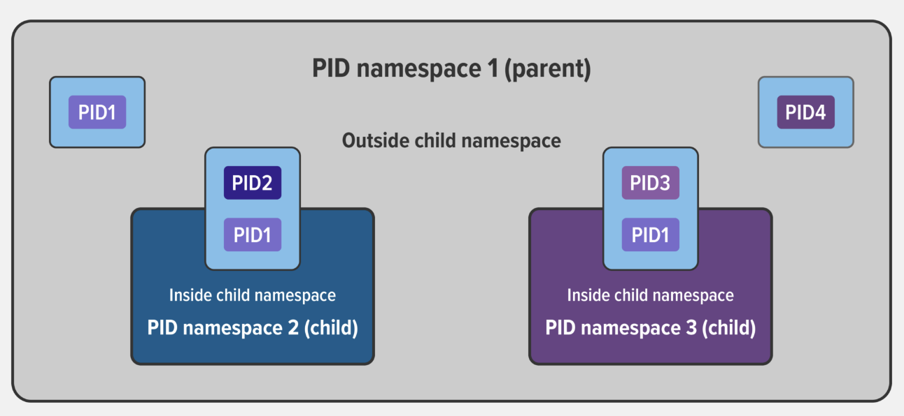

## Namespaces

Namespaces are a feature of the Linux kernel that allows us to isolate kernel resources for a set of processes. On a server where you are running many different services, isolating each service and its associated processes from other services means that there is a smaller blast radius for changes, as well as a smaller footprint for security‑related concerns. Mostly though, isolating services meets the architectural style of microservices.

### Benefits

#### Isolation of resources

One troublesome process won't be taking down the whole host, but only affects those processes belonging to a particular namespace.

#### Security

A security flaw in the process running under a given namespace won't give the attacker access to the whole system. Hence, it is important to avoid running processes using privileged users whenever possible.

### Containers

Namespaces are one of the technologies containers are built on (Docker, Podman, etc.), used to enforce segregation of resources. When using a container runtime, it creates a set of namespaces and control groups behind the scenes for you.

Using containers gives the developer an isolated environment that looks and feels like a complete VM, but is actually another process running on the server.

Cgroups namespace is a key component of containers as there are often multiple processes running in a container that you need to control together.

## Namespaces types

### User namespace

Contains an independent set of user IDs and group IDs that can be assigned to processes. A process can have root privilege within its user namespace without having it in other namespaces.

### PID namespace

Assigns a set of PIDs to processes that are independent from the set of PIDs in other namespaces. The first process created in a new namespace has PID 1, and child processes are assigned subsequent PIDs. A single process can have multiple PIDs associated with it, one for each namespace it falls under.

Processes in a new child namespace does not know the existence of other processes in its sibling or parent process trees. However, processes in the parent namespace have a complete view of processes in the child namespace.



### Mount namespace

A mount namespace has an independent list of mount points seen by the processes in the namespace. This means that you can mount and unmount filesystems in a mount namespace without affecting the host filesystem.

### Network namespace

A network namespace has an independent network stack: its own private routing table, set of IP addresses, socket listing, connection tracking table, firewall, and other network‑related resources.

### Inter-Process Communication (IPC) namespace

Allows defining shared memory segments between processes within a namespace for inter-process communications, not interfering with other namespaces.

### UTS (Unix Time-Sharing) namespace

Allows our system to have different host names and domain names for each namespace.

### Time-sharing namespace

Allows a single system to appear to have different system times, host and domain names to different processes.

### Cgroups (Control Groups) namespace

Limits the resource usage (CPU, memory, disk, etc.) for a particular group of processes.

## Creating a Namespace

```sh
$ unshare --user --pid --map-root-user --mount-proc --fork bash
$ ps -ef
$ lsns --output-all | head -1; lsns --output-all # see all namespaces
```
