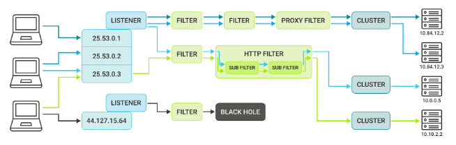

## Envoy

Envoy Proxy is an open-source edge and service proxy designed for cloud-native applications, and serves as a universal data plane for large-scale microservice service mesh architectures.

The idea is to have Envoy sidecars run next to each service in your application, abstracting the network and providing features like load balancing, resiliency features such as timeouts and retries, observability and metrics, and so on.

Envoy is a L7 proxy focused on full duplex networking across multiple protocols with transparency and observability.



## Elements

### Listener

The listener listens for connections. The connections are being sent from DOWNSTREAM.

```yaml
listeners:
  - name: envoy_listener
    address:
      socket_address:
        address: 127.0.0.1
        port_value: 10000
```

### Filter

Filters are Envoy's main operational units. Configuring Envoy is mostly a case of choosing the right filters e.g. TCP proxy filter, HTTP connection manager filter, etc.

Usually the last filter in the filter chain is a proxy filter or HTTP manager filter (as it contains routing options). An important thing to remember is that the response received from UPSTREAM will be processed in reverse order. Filters can be configured to work in only one direction.

Each listener can have multiple filter chains. When the traffic begins, the listener verifies the criteria for each filter chain and decides which one matches the given traffic. The listener chooses the first match which applies, so the most common matches should be described at the bottom of the list.

Usually the last filter in the filter chain is a proxy filter or HTTP manager filter (as it contains routing options). An important thing to remember is that the response received from UPSTREAM will be processed in reverse order. Filters can be configured to work in only one direction.

```yaml
# TCP
filter_chains:
  - filters:
      - name: envoy.filters.network.mysql_proxy
        typed_config:
          "@type": type.googleapis.com/envoy[...]v3.MySQLProxy
          stat_prefix: mysql

      - name: envoy.filters.network.rbac
        typed_config:
          "@type": type.googleapis.com/envoy[...]v3.RBAC
          stat_prefix: rbac
          rules:
            action: DENY
            policies:
              "product-viewer":
                permissions:
                  - metadata:
                      filter: envoy.filters.network.mysql_proxy
                      path:
                        - key: catalog.productdb
                      value:
                        list_match:
                          one_of:
                            string_match:
                              exact: update
                principals:
                  - any: true

      - name: envoy.filters.network.tcp_proxy
        typed_config:
          "@type": type.googleapis.com/envoy[...]tcp_proxy.v3.TcpProxy
          stat_prefix: tcp
          cluster: mysql
```

```yaml
# HTTP
filter_chains:
    - filters:
        - name: sending-to-server
        typed_config:
        "@type": type.googleapis.com/[...]v3.HttpConnectionManager
        stat_prefix: http_traffic
        route_config:
            name: local_routeå
            virtual_hosts:
            - name: backend
            domains:
            - "*"
            routes:
            - match:
                prefix: "/books/"
                route:
                prefix_rewrite: "/"
                cluster: books-server
            - match:
                prefix: "/"
                direct_response:
                status: 403
                body:
                    inline_string: "Page does not exist!"

            http_filters:
                http_filters:
                - name: sample
                    typed_config:
                    "@type": type.googleapis.com/sample.SampleFilter
                    key: DATA
                    val: "123"
                - name: envoy.filters.http.router
                    typed_config:
                    "@type": "type.googleapis.com/envoy.[...].Router"
```

### Cluster

An abstraction for UPSTREAM. This describes the target location for the client’s connections. If the location consists of multiple addresses it also defines the load balancing algorithm, which will be used by Envoy to resolve where exactly the data should be sent. Apart from the location it also defines what IP version should be used, the timeout, etc.

```yaml
clusters:
  - name: books-server
    connect_timeout: 8s
    # type defines how the cluster information should be obtained/parsed
    # static means we provide a list of IP addresses/ports, no DNS/service discovery used
    type: STATIC
    lb_policy: ROUND_ROBIN
    load_assignment:
      cluster_name: service
      endpoints:
        - lb_endpoints:
            - endpoint:
                address:
                  socket_address:
                    address: 127.0.0.1
                    port_value: 10100
            - endpoint:
                address:
                  socket_address:
                    address: 127.0.0.1
                    port_value: 10101
```

## CLI

### Validation

```sh
$ envoy --mode validate -c my-envoy-config.yaml
```
