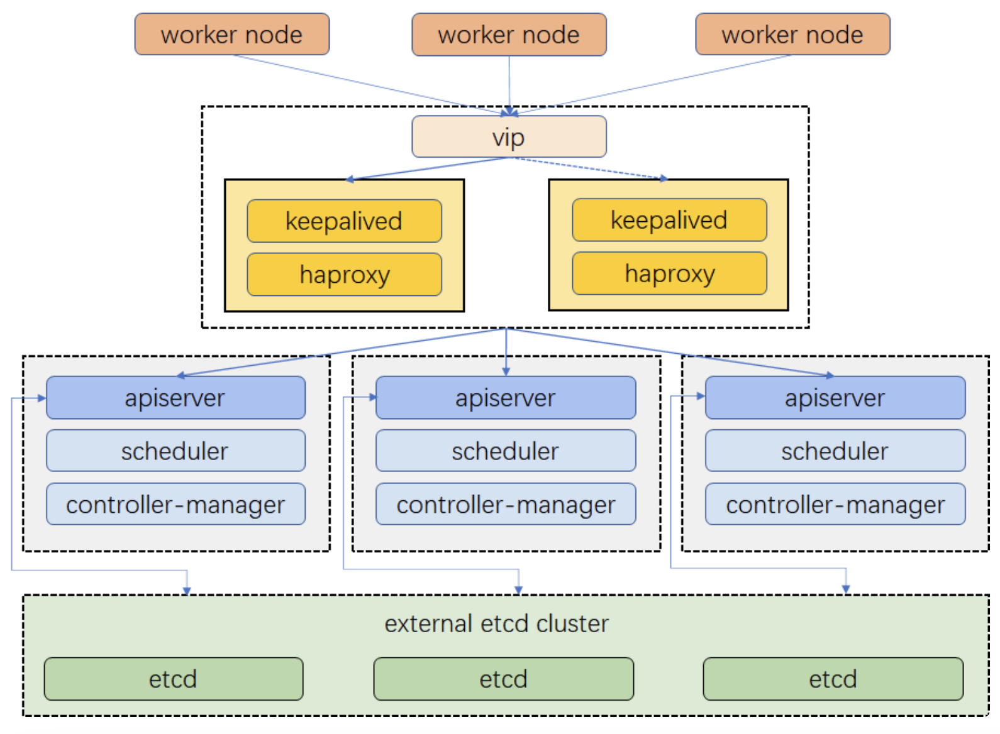

## HAProxy (High Availability Proxy)

HAProxy is a versatile and powerful open-source load balancer and proxy server software. It is designed to efficiently distribute incoming network traffic across multiple servers to ensure high availability, reliability, and optimal performance for web applications and services.

### Key features

- **Load balancing**: HTTP, HTTPS, TCP, and other protocols
- **High availability**: Can be configured in high-availability setups
- **Proxying**: Act as a reverse or forward proxy for additional layer of security and performance optimization
- **Health checking**: Regularly monitors the health of backend servers by sending health checks to ensure they are responsive
- **SSL/TLS termination**: Can handle SSL/TLS encryption and decryption, offloading the SSL/TLS processing from backend servers
- **Content-based routing**: Can route traffic based on content i.e. HTTP request headers, URL paths, etc.
- **Session persistence**: Supports session persistence, ensuring that requests from the same client are consistently routed to the same backend server
- **Rate limiting and access control**: For protecting applications from abuse and unauthorized access

### Use cases

- Web application load balancing (HTTP/HTTPS)
- API gateway
- TCP load balancing i.e. databases, email servers, custom protocols
- Reverse proxy
- Highly available services

### Setup

```sh
sudo apt install haproxy -y
sudo vim /etc/haproxy/haproxy.cfg

sudo haproxy -f /etc/haproxy/haproxy.cfg -c
sudo systemctl restart haproxy
```

```conf
global
  log /dev/log local0
  log /dev/log local1 notice
  chroot /var/lib/haproxy
  stats socket /run/haproxy/admin.sock mode 660 level admin
  stats timeout 30s
  user haproxy
  group haproxy
  daemon

defaults
  log global
  mode http
  option httplog
  option dontlognull
  timeout connect 5000
  timeout client 50000
  timeout server 50000

# Dictates how HAProxy listens for incoming connections
frontend www
  bind *:80
  default_backend my_backend

backend my_backend
  balance roundrobin
  server server1 192.168.1.101:80 check
  server server2 192.168.1.102:80 check
```

## HAProxy with Keepalived

Although Keepalived can function as a load balancer, it works in Layer 4 and hence, unable to support HTTP/HTTPS load balancing.

You can configure a HAProxy with Keepalived to make the HAProxy service fail over to a backup server in the event the primary HAProxy server fails.

The Keepalived daemon is installed on all load balancer servers. The Keepalived configuration should be similar.

### Example for Kubernetes cluster



### Keepalived setup

```sh
systemctl enable keepalived
sudo keepalived -t
sudo systemctl start keepalived

ip addr show dev eth0 # check status on master server
```

```conf
# master
global_defs {
  router_id haproxy2 # hostname of host
}

# Check if HAProxy process is running and failover if required
# Prevent split-brain scenario
vrrp_script chk_haproxy {
    script "killall -0 haproxy"
    interval 2 # Check every 2 seconds
    weight 2 # Weight to influence master election
}

vrrp_instance VI_1 {
    state MASTER
    interface eth0 # Network interface to bind to, use ifconfig
    virtual_router_id 51 # Shared by both servers
    priority 101 # Higher priority on the primary server
    advert_int 1
    # Authentication between keepalived daemons
    # to communicate with one another
    authentication {
        auth_type PASS
        auth_pass YourPassword
    }
    unicast_src_ip 172.16.0.2 # The IP address of this machine
    unicast_peer {
        172.16.0.3 # The IP address of peer machines
    }
    virtual_ipaddress {
        192.168.1.100 # VIP address shared between primary and backup
    }
    track_script {
        chk_haproxy
    }
}
```

```conf
# Backup server
global_defs {
  router_id haproxy4 # hostname of host
}

vrrp_script chk_haproxy {
    script "killall -0 haproxy"
    interval 2
    weight 2
}

vrrp_instance VI_1 {
    state BACKUP
    interface eth0
    virtual_router_id 51
    priority 100
    advert_int 1
    authentication {
        auth_type PASS
        auth_pass YourPassword
    }
    unicast_src_ip 172.16.0.3
    unicast_peer {
        172.16.0.2
    }
    virtual_ipaddress {
        192.168.1.100
    }
    track_script {
        chk_haproxy
    }
}
```
