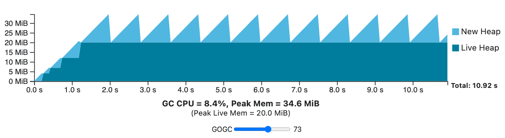
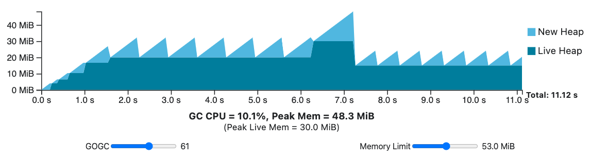

## Memory management

When a program is executed, it needs to store data and instructions to execute. Memory is allocated more efficiently based on the lexical scope in which it’s created:

- Local variables and function calls are placed on the memory stack (LIFO data structure), also known as **stack allocation**. This is more efficient than relying the GC, as the Go compiler can predetermine when that memory may be freed and emit machine instructions that clean up
- If the compiler can't determine the exact lifespan of a variable, it is placed in the **heap**, where memory is dynamically allocated. As both the compiler and runtime can make very few assumptions as to how this memory is used and when it can be cleaned up, this task is delegated to the GC

## Garbage collection (GC)

Go automatically manages the allocation of variables and includes the GC that automatically recycles memory as needed. The primary role of the GC is to identify and reclaim memory specifically from these dynamic allocations in the heap:

- Automatically free up memory from unreachable objects, preventing memory leaks
- Minimize memory management errors, such as use-after-free and dangling pointers
- Operate concurrently with the program, reducing pause times
- Abstract away the complexities of manual memory management for developers
- Ensure efficient memory management with minimal overhead

### Mark-sweep

The “mark-sweep” term describes the two-phase approach to memory reclamation used by Go’s GC (Both phases are executed concurrently with the program):

- **Mark phase**: During this phase, the garbage collector traverses the object graph (objects and pointers), starting from the roots (e.g. local and global variables). GC marks the values it encounters as live
- **Sweep phase**: The GC then walks over all memory in the heap and makes all memory that is not marked available for allocation

## GC cycle

As the Go GC is a mark-sweep GC, it's not possible to release memory back to be allocated until all memory has been traced, as there may still be an unscanned pointer keeping an object alive. The GC continuously rotates through the three phases of sweeping, off (no work to do), and marking.

Each GC cycle ends while the new heap drops to zero. The time taken while the new heap drops to zero is the combined time for the mark phase for cycle N, and the sweep phase for the cycle N+1.

### Resources

The GC has to balance between using the computer’s processor (CPU) and its storage (memory):

- **Memory**: Includes the currently active memory (determined by previous GC cycle), any new memory added before the marking step (allocated in the current GC cycle), and space for some extra details (metadata)
- **CPU**: The CPU use has two parts: one fixed part for running the GC and another part that changes based on how much memory is active

The trade-off is entirely defined by **GC frequency**. In Go, deciding when the GC should start is the main parameter which the user has control over.

### GOGC

GOGC determines the target heap size after each GC cycle. The GC's goal is to finish a collection cycle before the total heap size exceeds the target heap size.

```
Target heap memory = Live heap + (Live heap + GC roots) × GOGC/100

Example:
- Live heap size of 8 MB
- 1 MB of goroutine stacks
- 1 MB of pointers in global variables
- GOGC of 100

Amount of new memory allocated: 10 MB
Total heap footprint: 18 MB
```

The heap target controls GC frequency: the bigger the target, the longer the GC can wait to start another mark phase and vice versa. The key takeaway is that **doubling GOGC will double heap memory overheads and roughly halve GC CPU cost**, and vice versa.



### GOMEMLIMIT

Until Go 1.19, GOGC was the sole parameter to modify the GC's behavior. However, it does not take into account the available memory is finite.

For example, if there is a transient spike in live heap size, the peak memory determined by the GOGC will be higher than usual. If it exceeds the memory limit, the GOGC cannot be configured above a certain value, even if the rest of the GC cycles have the available memory to make use of that extra memory. Furthermore, in some applications, these transient peaks can be rare and hard to predict, leading to occasional, unavoidable, and potentially costly out-of-memory conditions.

Hence, Go added support for setting a runtime memory limit, known as the GOMEMLIMIT. When the GOMEMLIMIT is lowered below the peak memory determined by GOGC, the GC runs more frequently, and vice versa.

The use of GOMEMLIMIT does come with a cost. If the live heap grows large enough to bring total memory use close to the memory limit, with a lower GOGC, the total time the application takes will start to grow in an unbounded manner as the GC is constantly executing to maintain an impossible memory limit. This situation is called **thrashing**, and it happens when the program fails to make reasonable progress due to **constant GC cycles**.



## Suggested uses

- Do **take advantage of the memory limit** when the execution environment of your Go program is entirely within your control e.g. web application. A good rule of thumb is to leave an additional **5-10% of headroom** to account for memory sources the Go runtime is unaware of
- Do feel free to adjust the memory limit in real time to adapt to changing conditions
- Don't use the memory limit when deploying to an execution environment you don't control, especially when your program's memory use is proportional to its inputs

## Stop-the-world concurrency and latency

Stop-the-world GCs implementation involve pausing the application while the GC is executing.

However, the Go GC is not fully stop-the-world, and does most of its work **concurrently** with the application to reduce application latencies. Collecting concurrently is not without cost: in practice it often leads to a design with lower throughput than an equivalent stop-the-world GC.

Possible sources of latency include:

- Brief stop-the-world pauses when the GC transitions between the mark and sweep phases
- Scheduling delays because the GC takes 25% of CPU resources when in the mark phase
- User goroutines assisting the GC in response to a high allocation rate
- Pointer writes requiring additional work while the GC is in the mark phase
- Running goroutines must be suspended for their roots to be scanned
