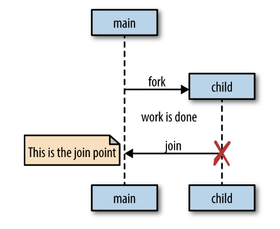

## Goroutines

Each concurrently executing activity is called goroutine (similar to threading). A sequential program may call one function and then another, but a concurrent program with two or more goroutines, call to both functions at same time. When program starts, its only goroutine is the one that calls main() i.e. main goroutine. New goroutines are created by go statement.

```go
f()
go f()  // creates new goroutine that calls f(); doesn't wait for f() to finish
```

```go
func main() {
  go spinner(100 * time.Milisecond)
  const n = 45
  fibN := fib(n)
  fmt.Printf("\rFibonacci(%d) = %d\n", n, fibN)
}

func spinner(delay time.Duration) {
  for {
    for _, r := range `-\|/` {
      fmt.Printf("\r%c", r)
      time.Sleep(delay)
    }
  }
}

func fib(x int) int {
  if x < 2 {
    return x
  }
  return fib(x-1) + fib(x-2)
}
```

## How goroutines work

Goroutines are not OS threads nor green threads (managed by a language's runtime), but a higher level of abstraction known as **coroutines**. Coroutines are simply concurrent subroutines (functions, closures, methods) that are non-preemptive i.e. cannot be interrupted. Instead, coroutines have multiple points throughout which allow for suspension or reentry.

### Scheduling

Go’s mechanism for hosting goroutines is an implementation of what’s called an M:N scheduler, which means it maps M green threads to N OS threads i.e. runtime handles multiplexing the goroutines onto any number of OS threads. When we have more goroutines than green threads available, the scheduler handles the distribution of the goroutines across the available threads and ensures that when these goroutines become blocked, other goroutines can be run.

### Fork-join model

Go follows a model of concurrency called fork-join model. Fork refers to the fact that at any point in the program, it can split off a child branch of execution to be run concurrently with the parent. Join refers to the fact that at some point in the future, these concurrent branches of execution will join back together.



### Context switching

Context switching is when something hosting a concurrent process must save its state to switch to running a different concurrent process. If we have too many concurrent processes, we can spend all of our CPU time context switching between them and never get any real work done. At the OS level, with threads, this can be quite costly.

The OS thread must save things like register values, lookup tables, and memory maps to successfully be able to switch back to the current thread when it is time. Then it has to load the same information for the incoming thread.

However, context switching in software is much cheaper. Under a software-defined scheduler, the runtime can be more selective in what is persisted for retrieval, how it is persisted, and when the persisting need occur.

It’s difficult to make any claims about how many goroutines will cause too much context switching, but we can comfortably say that the upper limit is likely not to be any kind of barrier to using goroutines.

## Goroutine vs thread

<table>
<tr>
<th>Goroutine</th>
<th>Threads</th>
</tr>

<tr>
<td>Managed by the go runtime</td>
<td>Managed by kernel</td>
</tr>

<tr>
<td>Not hardware dependent</td>
<td>Dependent on OS system</td>
</tr>

<tr>
<td>Have easy communication medium through channel with low latency; does not need explicit managed locks and mutexes for synchronization</td>
<td>Does not have an easy communication medium with high latency</td>
</tr>

<tr>
<td>Does not have a unique ID as it does not have Thread Local Storage</td>
<td>Have their own unique ID</td>
</tr>

<tr>
<td>Cheaper than threads, faster startup time</td>
<td>More expensive than goroutine</td>
</tr>

<tr>
<td>Are cooperatively scheduled</td>
<td>Are preemptively scheduled</td>
</tr>

<tr>
<td>Have growable segmented stacks; allows dynamic stack management to efficiently create goroutines without wasting memory</td>
<td>Does not have growable segmented stacks i.e. fixed-size stacks which can be wasteful for small tasks</td>
</tr>

</table>
