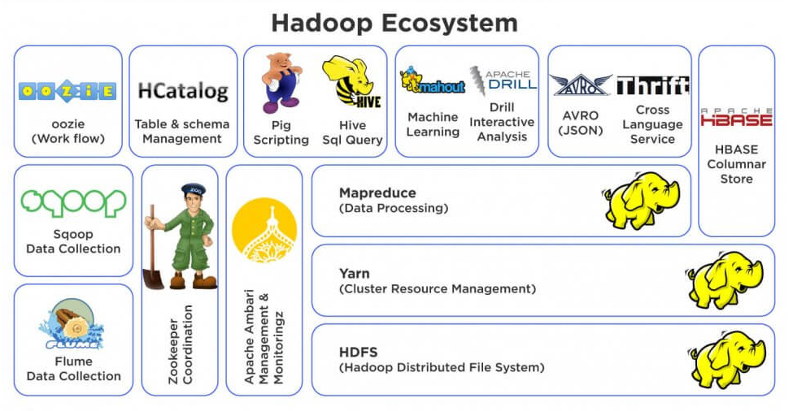

## Ecosystem

Overall ecosystem encompasses both core modules and related sub-modules.

### Core Modules

Four core modules are HDFS, YARN, MapReduce and Common.

### HDFS (Hadoop Distributed File System)

File system that runs on standard or low-end hardware. Provides better data throughput than traditional file systems, in addition to high fault tolerance and native support of large datasets. Maintains redundant copies of data to recover from failures.

### YARN (Yet Another Resource Negotiator)

Manages and monitors cluster nodes and resource uage. It schedules jobs and tasks.

### MapReduce

Framework that distributes the processing of data on your cluster. Resilient to failure with an application master that monitors your mappers and reducers on each partition. Originally, MapReduce was the only execution engine available in Hadoop, but now has support for Apache Tez and Apache Spark.

Mappers and Reducers are written natively in Java; however, STREAMING allows interfacing to other languages i.e. Python.

- Mapper takes input data and transforms it into key value pairs.
- Shuffle and Sort is performed to group identical keys together.
- Reducer aggregates the output of map task and provides the desired result.

### Hadoop Common

Provides a set of services across Java libraries and utilities to support other Hadoop modules.

### Apache Pig

Tool that sits on top of MapReduce to analyze large datasets represented as data flows. Pig enables operations like join, filter, sort, load, etc. Helps programmers that don't write MapReduce in Java or Python. High level programming API that allows you to write SQL scripts to chain together queries and get complex answers.

### Apache Hive

Sits on top of MapReduce and solves similar to Pig. Takes SQL queries and makes distributed data sitted in file system look like SQL database. Enables users to work with data in HDFS using a SQL-like query language called HiveQL by providing a useful API interface.

### Apache Ambari

Sits on top of everything and gives a view/state of your cluster and visualize what's running on it. Also allows you to execute Hive queries or import databases.

### MESOS

Alternative to YARN to manage resources on your cluster.

### Apache Spark

An open-source, distributed processing system commonly used for big data workloads. Sits on top of YARN/MESOS. Uses in-memory caching and optimized execution for fast performance, and supports general batch processing, streaming analytics, machine learning, graph databases, and adhoc queries.

Requires developers to write Spark scripts in Python/Java/Scala like MapReduce. Allows data to be quickly, efficiently and reliably processed on your cluster.

### Tez

Similar to Spark and uses a technique called directed acyclic graph and produce more optimal plans for executing queries. Typically used in conjuction with Hive to accelerate it. Hive through Tez can often be faster than Hive through MapReduce.

### HBase

An open-source, non-relational, versioned database that runs on top of HDFS. It is a massively scalable, distributed big data store built for random, strictly consistent, real-time access for tables with billions for rows and millions of columns.

### Apache Storm

An open-source, distributed computation system to process streams of data in realtime. Storm solutions can provide guaranteed processing of data, with the ability to replay data that wasn't successfully processed the first time.

### Apache Oozie

Workflow scheduler system to manage jobs with complex operations on Hadoop cluster. Example would be loading data into Hive, then integrating with Pig, then querying with SPARK, and finally transforming the results into HBase.

### Apache Zookeeper

Centralized service for enabling highly reliable distributed processing i.e. coordinating everything on your cluster. Keeps track of which nodes are active and shared states.

## Data Ingestion

Systems that manages getting data into Hadoop cluster from external sources.

### Apache Sqoop

Tool designed for efficiently transferring bulk data between Hadoop and structured datastores such as relational databases into HDFS. Connector between Hadoop and legacy databases.

### Flume

Transports web logs at very large scale reliably to your cluster in real-time.

### Kafka

Collects data of any sort from a cluster of PCs, web servers and broadcast into your Hadoop cluster for a more general purpose.

## Query Engines

### Apache Drill

Allows you to write SQL queries that will work across a wide range of NoSQL databases.

### Apache Phoenix

Similar to Apache Drill but maintains ACID compliance i.e. making NoSQL data store look like relational dataabase.

### Presto

An open-source, distributed SQL query engine optimized for low-latency, ad-hoc analysis of data. Can process data from multiple data sources.

### Apache Impala

Open source, native analytic database for Apache Hadoop.
