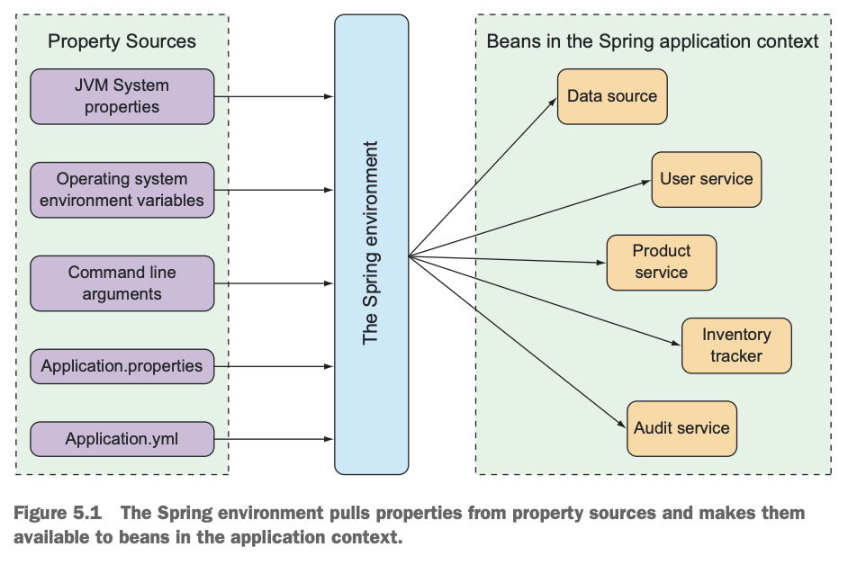

## Spring Environment Abstraction

The Spring environment abstraction is a one-stop shop for any configurable property. It abstracts the origins of properties so that beans needing those properties can consume them from Spring itself. The environment pulls from several property sources including:

- JVM system properties
- OS environment variables
- Command-line arguments
- Application property configuration files



## Fine-tuning Autoconfiguration

There are kinds of configuration in Spring:

- Bean wiring: Configuration that declares application components to be created as beans in the application context and how they should be injected into each other
- Property injection: Configuration that sets values on beans in the application context

```java
@Bean
public DataSource dataSource() {
    return new EmbeddedDataSourceBuilder()
    .setType(H2)
    .addScript("taco_schema.sql")
    .addScripts("user_data.sql", "ingredient_data.sql")
    .build();
}
```

## Examples

### Data Source

Naming style might be slightly different to accomodate restrictions placed on OS environment variables. Spring is able to sort and interpret SERVER_PORT as server.port with no problems.

```yaml
spring:
  datasource:
    url: jdbc:mysql://localhost/tacocloud
    username: tacodb
    password: tacopassword
    driver-class-name: com.mysql.jdbc.Driver # Spring can auto figure out
```
