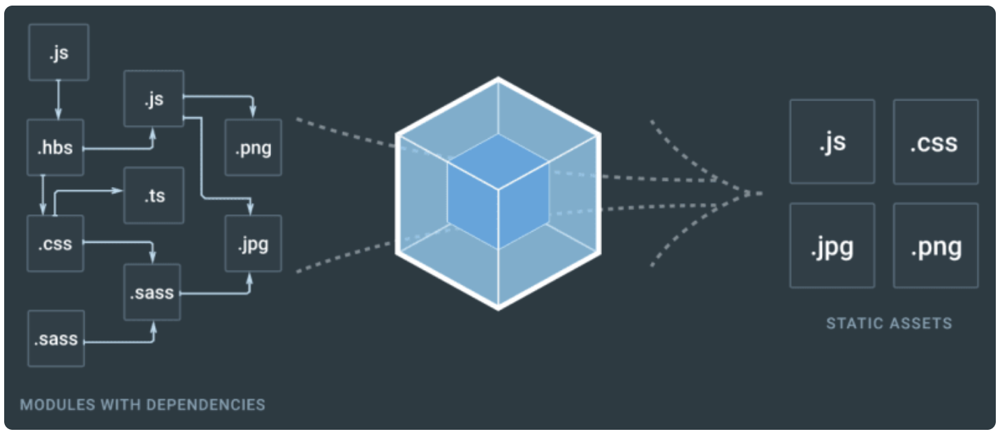

## Module bundlers

A bundler is a development tool that combines many JS code files into a single one that is production-ready loadable in the browser. It streamlines the development process by resolving dependencies and merging multiple files into fewer or a single file, which **enhances performance and simplifies deployment**.

Key features include:

- Dependency Management: Module bundlers automatically handle the inclusion and ordering of JavaScript files based on their interdependencies
- Code Transformation: They provide a way to use future JavaScript features by transforming code to be compatible with current browsers
- Asset Optimization: Bundlers minify and optimize assets like images, CSS, and JavaScript, improving load times
- Plugin Ecosystem: A rich set of plugins are available to extend functionality, such as code splitting, lazy loading, and tree shaking

Tasks common to build tools include:

- Minifying and/or compressing files
- Optimizing images and fonts
- Concatenating files
- Compiling or transpiling code
- Generating a development server
- Hot reloading modules without a full page refresh
- Watching files and generating builds automatically when detecting changes

### Without bundler

With modular programming, you divide functionalities into individual files. However, you have to be mindful of dependency order and naming collision. Also, each file requires a separate HTTP request.

```html
<html>
  <head></head>
  <body>
    <script type="text/javascript" src="./components/a.js"></script>
    <script type="text/javascript" src="./components/b.js"></script>
    <script type="text/javascript" src="./main.js"></script>
  </body>
</html>
```

### With bundler

```js
const path = require("path");

module.exports = {
  entry: "./src/index.js",
  output: {
    path: path.resolve(__dirname, "dist"),
    filename: "bundle.js",
  },
};
```

```html
<!DOCTYPE html>
<html>
  <head>
    <meta charset="utf-8" />
    ...
  </head>
  <body>
    ...
    <script src="dist/bundle.js"></script>
  </body>
</html>
```

### Examples

Examples include Webpack, Rollup, Fusebox, Parcel, etc.

## Features

### Code splitting

Provide an easy solution to split code into various bundles based on size or dynamic import syntax.

### Hot module replacement

Update module change automatically in the browser without a full reload.

### Tree shaking

Remove unused export from injected libraries (written in ES2015 Module) rather than bundling the whole library. It relies on the import and export statements to detect if code modules are exported and imported for use between JavaScript files i.e. removes dead code.

## How it works

A bundler's operation is divided into two stages: dependency graph generation and eventual bundling.



### Dependency resolution

Dependency resolution is a process to create a relationship graph (dependency graph) between each module/file.

Beginning with the **entry point** you specify, the module bundler keeps track of both your source files' dependencies and third-party dependencies. This dependency graph guarantees that all source and associated code files are kept up to date and error-free. You can specify one or multiple entry points.

This process is necessary because it:

- Enables the module to construct a dependency order, vital for retrieving functions when a browser requests them
- Prevents naming conflicts
- Eliminates unused and unreachable files

### Packing

Packing is a process of bundling everything based on the created dependency graph and the specified configuration into something that is executable by the browser i.e. outputs static assets.

During this process, the bundler will leverage the dependency graph to integrate our multiple code files, inject the required function and exports object, and return a **single executable bundle** that the browser can load successfully.
