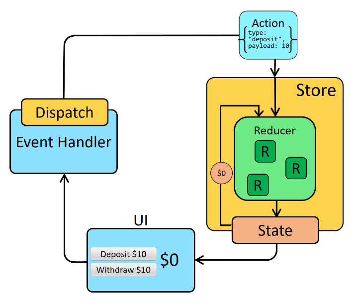

## Redux

Library with state management pattern that stores states (global) in central store i.e. centralized place to make changes. When changing states, services/components will dispatch actions where updated states are sent to Reducers which will reduce/combine state. State changes must always be immutable i.e. cannot edit existing/previous state. NgRx is a Redux version for Angular.

When you need to share and use the same state across multiple components, one way is to "lift state up" to parent components, but that doesn't always help. One way to solve this is to extract the shared state and put it into a centralized location outside the component tree.

Main purpose of redux pattern is to provide a predictable state container based on three principles:

1. Single source of truth i.e. state of whole application is stored in an object tree within a single store.
2. State is read-only/immutable; actions are dispatched instead i.e. getting, adding, removing, updating state.
3. Changes are made with pure functions through Reducer function which returns a new state object.

```console
$ npm install redux react-redux
$ npm install @reduxjs/toolkit
```

### Immutability

In order to update values immutably, code must make copies of existing objects/arrays, and then modify the copies.

```js
const obj = { a: 1, b: 2 };
const obj2 = { ...obj, c: 42 };

// this is illegal!
state.value = 123;

// this is safe
return {
    ...state,
    value: 123,
};
```

### Flow

1. Component dispatches an action describing "what happened".
2. Reducer takes action object and current state, and returns a new state value.
3. Reducer returns new state to Store.
4. State is updated in component through subscription.



## Actions

The whole global state of your app is stored in an object tree inside a single store. Actions are triggers that can result in state changes i.e. the only way to change the state tree is to create an action. An object that contains a key called "type", and "payload" for optional extra data. Dispatched to Reducer from Components. Actions reach out to all Reducers; need return DEFAULT case if no case found. Have two properties:

1. type: read only string describing what the action stand for.
2. payload: the data sent to the Reducer (not all actions need a payload).

Can prefix for larger applications as different components may have same action name i.e. "[SHOPPING LIST] Add Ingredients".

```js
dispatch();
```

## Reducers

Pure functions that has no side effects, and its return value is determined only by its inputs. Functions that reduce/transform input data i.e. takes a current state value and an action object, and returns a new state value.

Accepts two arguments, previous State and Action. When an Action is dispatched, Redux goes through all reducers in the order the Reducers were created until it finds a case for that Action. Must always return a new state object (same input returns same output). NEVER MUTATE a state but ALWAYS OVERRIDE existing state as best practice.

Should never mutate arguments in Reducer, perform side-effects like API calls, and call non-pure functions i.e. Date.now() or Math.random().

```js
function counterReducer(state = { value: 0 }, action) {
    switch (action.type) {
        case "counter/incremented":
            return { value: state.value + 1 };
        case "counter/decremented":
            return { value: state.value - 1 };
        default:
            return state;
    }
}
```

## Effects

If an Effect gets triggered by dispatching an Action, this means side effects are going to happen before calling the Reducer i.e. http requests. Effects listen if any Action is dispatched and checks if it has a a case for Action type. After performing side effect, emits another Action referring to the result-state of side effect (success/error), and Reducer finally enters the scene. For Effects, it must always return a non-erronous Observable as the pipe operator cannot die; hence, use of().

## Store

Database of application comprising of different states that are immmutable and only altered by actions. An object that holds application state and brings Actions, Reducers and Selectors together i.e. when an action is dispatched, the store finds and executes the appropriate Reducer. Store folder contains Actions, Effects, Reducers, Selectors and State folders.

### APIs

```
subscribe()
dispatch()      Only way to update state, takes in an action object and store runs reducer fn
getState()      Returns current state value
```

```js
// Its API is { subscribe, dispatch, getState }.
let store = createStore(counterReducer);

// use subscribe to update the UI in response to state changes
// normally would use a view binding library (e.g. React Redux) rather than subscribe() directly
store.subscribe(() => console.log(store.getState()));

// The only way to mutate the internal state is to dispatch an action
// The actions can be serialized, logged or stored and later replayed
store.dispatch({ type: "counter/incremented" });
// {value: 1}
store.dispatch({ type: "counter/incremented" });
// {value: 2}
store.dispatch({ type: "counter/decremented" });
// {value: 1}
```

```js
// selectors are functions that know how to extract specific pieces of info from a store state value
// this can help to avoid repeating logic
const selectCounterValue = (state) => state.value;

const currentValue = selectCounterValue(store.getState());
console.log(currentValue);
```

### Slices

Slice is a collection of Redux reducer logic and actions for a single feature in your app.

```js
import { configureStore } from "@reduxjs/toolkit";
import counterReducer from "../features/counter/counterSlice";

export default configureStore({
    reducer: {
        // redux slices
        // we want to have a state.counter of Redux state object
        // and counterReducer to handle to state changes
        counter: counterReducer,
        users: usersReducer,
        posts: postsReducer,
        comments: commentsReducer,
    },
});
```
