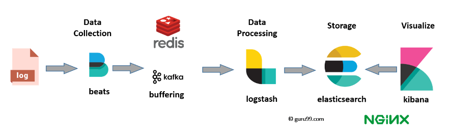

## ELK Stack

Collection of three open-source products maintained by Elastic: Elasticsearch, Logstash and Kibana. Provides centralized logging in order to identify problems with servers or applications. Allows you to search all the logs in one place, and allows you to find issues in multiple servers by connecting logs during a specific time frame. Works best when logs from various apps of an enterprise coverage converge into a single ELK instance.

Modern log management and analysis solutions include the following capabilities:

- Aggregation: Collect and ship logs from multiple data sources.
- Processing: Transform log messages into meaningful data for easier analysis.
- Storage: Store data for extended time periods to allow for monitoring, trend analysis, and security use cases.
- Analysis: Dissect data by querying and creating visualizations and dashboards.

## Components

When dealing with large amounts of data, may need Kafka/RabbitMQ for buffering and resilience. For security, Nginx can be used. A full-production-grade architecture will consist of multiple Elasticsearch nodes, Logstash instances, an archiving mechanism, and alerting plugin and a full replication across regions/segments of your data center for high availability.

- Logs: Server logs that need to be analyzed are identifed.
- Beats: Data collection.
- Logstash: Collect logs and events, parses and transforms data.
- ElasticSearch: Transformed data from Logstash is stored, search and indexed.
- Kibana: Kibana uses ElasticSearch DB to explore, visualize and share (visualization layer).

### ElasticSearch

- Open-source search server written in Java.
- Based on Apache Lucene search engine.
- Used to index any kind of heterogeneous data (noSQL).
- Full-text and Near Real Time (NRT) search.
- Has RESTful API interface with JSON output.
- Sharded, replicated searchable, JSON document store.
- Offers simple deployment, maximum reliability, and easy management.
- Offers advanced queries to perform detail analysis and stores all the data centrally.

### Logstash

Data collection pipeline tool. Collects data inputs and feeds into Elasticsearch. Can unify data from disparate sources and normalize data into your desired destinations.

Consists of three components:

- Input: Passing logs to process them into machine understandable format.
- Filters: Set of conditions to perform a particular action or event.
- Output: Decision maker for processed event or log.

### Kibana

Data visualization tool for Elasticsearch documents and help developers to have a quick insight into it.

Search types as follows:

- Free text: Search a specific string.
- Field-level: Search for a string within a specific field.
- Logical statements: Combine searches into a logical statement.
- Proximity: Searching terms witin specific character proximity.

## ELK vs Splunk

| ELK                                                                    | Splunk                                                         |
| ---------------------------------------------------------------------- | -------------------------------------------------------------- |
| Open-source.                                                           | Commercial.                                                    |
| Does not offer Solaris Portability because of Kibana.                  | Offers Solaris Portability.                                    |
| Processing speed is strictly limited.                                  | Offers accurate and speedy processes.                          |
| Analysis and visualization are only possible after ELK stack is setup. | Splunk is a complete data management package at your disposal. |
| Does not support integration with other tools.                         | Useful tool for setting up integrations with other tools.      |

|
