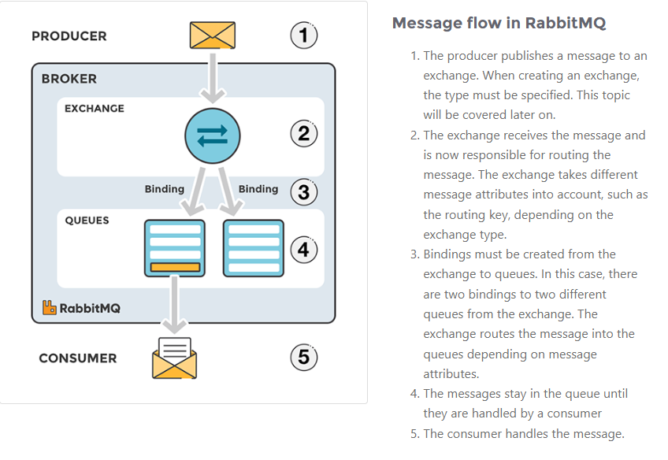

## RabbitMQ

Most widely deployed open source message broker/queue manager. Lightweight and easy to deploy on premises and in the cloud. Can be deployed in distributed and federated configurations to meet high-scale, high-availablity requirements.

RabbitMQ can deal with high-throughput use cases such as online transacations or payment processing. It is generally used to handle background and CRON jobs (scheduler) or as a message broker between microservices.

### Acknowledgements

If a consumer dies (channel closed, TCP connection lost), RabbitMQ will re-queue if it didn't receive an acknowledgement from the consumer. Timeout is 30minutes by default.

## Architecture

Messages are not published directly to a queue; instead, producer sends messages to an exchange. The exchange is responsible for routing the messages to different queues with the help of bindings and routing keys. A binding is a link between a queue and an exchange.

## Exchanges

- Direct: Message is routed to the queues whose binding key matches exactly with each other.
- Fanout: Routes messages to all of the queues bound to it.
- Topic: Performs wildcard match between routing key and routing pattern specified in the binding.
- Headers: Use the message header attributes for routing.

## Features

### Reliability and Performance

Have the option to trade off performance with reliability, or trade for performance by sacrificing persistence, delivery acknowledgements, publisher confirms and high availability.

### Flexible Routing

Messages are routed through exchanges before arriving at queues, thus making complex routing possible.

### Clustering

Can form a single broker from multiple RabbitMQ servers on a local network by clustering them together.

### Multi-Protocol and Clients

Supports messaging over a variety of messaging protocols including STOMP, MQTT, AMQP, HTTP and Websockets. Has clients for almost any langauge you may use.
