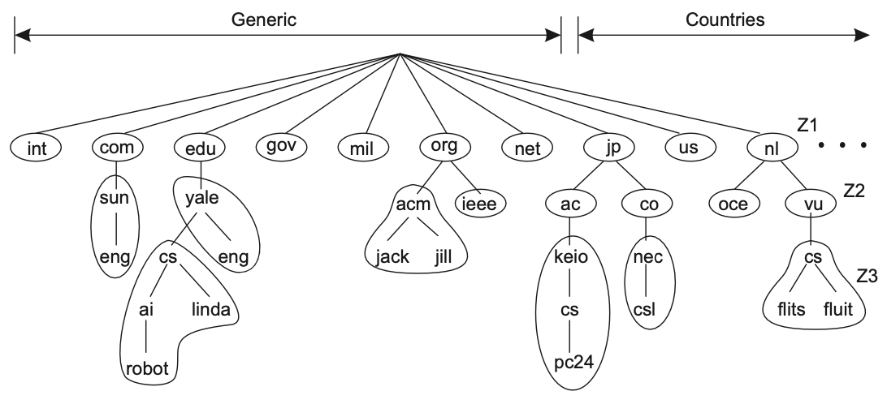

## Domain namespace

DNS is a distributed database that is indexed by domain names. Each domain name is essentially just a path in a large inverted tree, called the domain namespace. The tree's hierarchial structure is similar to the Unix filesystem.

The DNS namespace is a logically centralized solution that is hierarchically organized into a tree of domains, which are divided into non-overlapping zones (subdomains). Each path from the root to a leaf node represents a FQDN.

A label has a maximum length of 63 characters, and the length of a complete path name is restricted to 255 characters. The root is represented by a dot.

## Nameservers

The programs that store information about the domain namespace are called nameservers. Nameservers generally have complete information about some part of the domain namespace, called a **zone**, which they load from a file or from another nameserver.

A zone contains all the domain names the domain with the same domain name contains, except for domain names in delegated subdomains. The zone also contains the domain names and data in any subdomains that aren’t delegated away.

### Primary vs secondary masters

The DNS specs define two types of nameservers:

- **primary master**: A primary master nameserver for a zone reads the data for the zone from a file on its host. It is responsible for distributing update information for each domain namespace to other secondary domain nameservers
- **secondary master**: A secondary master nameserver for a zone gets the zone data from its master nameserver
