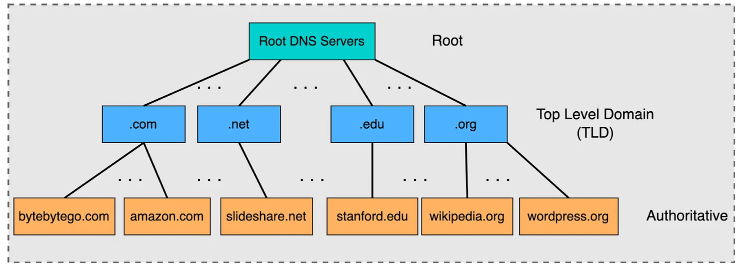
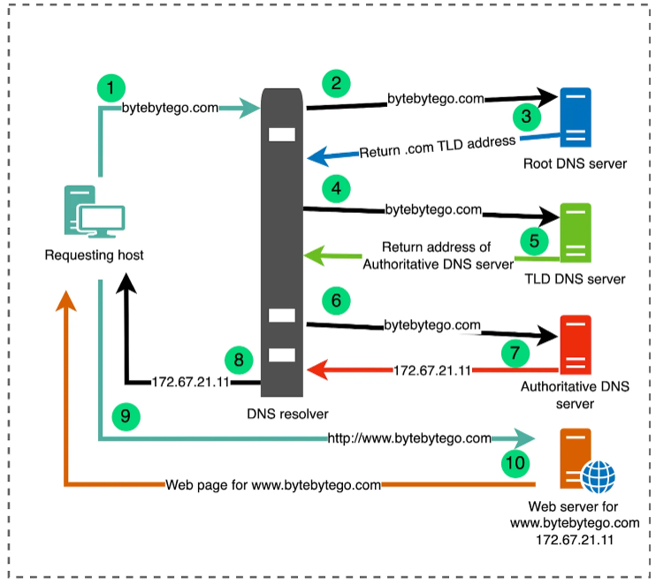
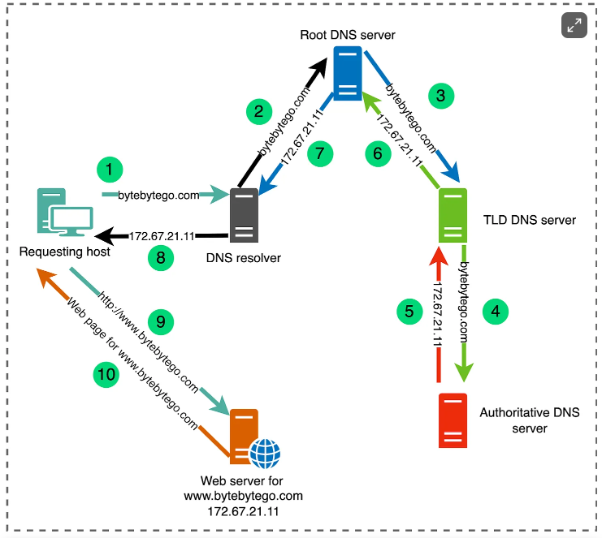

## DNS hierarchy

DNS operates as distributed hierarchical database.

### DNS recursor

Serves as the middleman between a client and the other DNS servers, following a chain of referrals from each one until it locates the requested host’s IP address. The recursor will also cache information in order to respond faster to subsequent client requests.

### Root nameserver

Receives the first request from the DNS recursor and sends back the appropriate top level domain (TLD) server, based on the queried host’s domain extension.

### Top-level-domain (TLD) server

Maintains information for all domain names with the same domain extension e.g. .com, .edu, .net, .org, etc. A TLD server receives the next request from the DNS recursor and responds with the appropriate authoritative nameserver.

### Authoritative nameserver

Stores the DNS records that map domain names to IP addresses. The authoritative nameserver responds to a DNS recursor’s final request with the queried hostname’s IP address. If the IP address is not available, the nameserver will throw an error.

As a final step in the DNS resolution process, the DNS recursor sends the IP address back to the client’s browser, allowing it to connect to and load the appropriate website or application.

## DNS resolution

Most hosts on a network (internal or external) have both a unique IP address and a hostname. When a client searches for a hostname, their network’s DNS provider executes a multi-step resolution process via the following four servers in order to find and return the appropriate IP address.

There are two methods of query resolution in DNS:

- Iterative query resolution
- Recursive query resolution

### Iterative query resolution

In iterative query resolution, the DNS server receiving the query provides referrals to the querying server, guiding it through the DNS hierarchy. The querying server actively participates in the process by sending subsequent queries based on the referrals received.

### Recursive query resolution

In recursive query resolution, the DNS server receiving the query takes on the responsibility of finding the IP address on behalf of the client. It may itself use iterative queries to navigate through the DNS hierarchy until it reaches the authoritative DNS server for the requested domain.

## Challenges

### Network outages

DNS resolution issues are often the root cause of network outages. As modern infrastructure creates more complex and interconnected networks, a misconfiguration in a single DNS server, such as a missing or mistyped IP address in an authoritative server, can lead to cascading failures for all of the services that communicate with it. But resolution problems have historically been difficult to troubleshoot. For example, teams may need to investigate each server involved in a DNS lookup in order to pinpoint the root cause of an error. To complicate the matter further, DNS resolution issues are not limited to a particular server or environment; they can also result from client-side settings (e.g., browser versions) that organizations may not have visibility into.

### Target for DDoS attacks

Another major challenge stems from the consolidation of third-party DNS providers in recent years. Many high-traffic applications rely on the same provider, creating a single point of failure that can disrupt service on a global scale. Because of their central role in supporting both internal and external communication for a vast majority of organizations, DNS providers are primary targets for DDoS and cache poisoning attacks. In these cases, organizations are limited in their ability to mitigate an outage, especially if they rely on a single provider.
