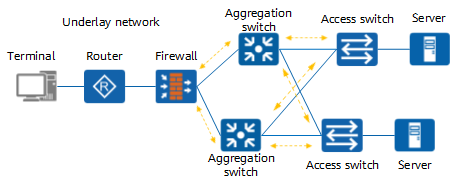
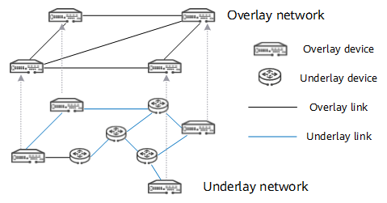

## Underlay network

An underlay network is a physical network consisting of multiple types of devices and is responsible for data packet transmission between networks. The underlay network can either be a Layer 2 or Layer 3 network:

- Layer 2: Ethernet network i.e. where VLANs are created
- Layer 3: Internet network

On an underlay network, devices such as switches, routers, load balancers, and firewalls can be interconnected. However, routing protocols must be used to ensure IP connectivity between these devices.

### Challenges

However, traditional network devices **forward data packets based on hardware**. An underlay network constructed based on traditional network devices has the following problems:

- Packet forwarding is highly dependent on transmission paths
- When services are added or changed, existing underlying network connections need to be modified; the reconfiguration is time-consuming
- The security of private communications cannot be ensured on the Internet
- Network slicing and segmentation are complex, and cannot achieve on-demand allocation of network resources
- Multi-path forwarding is complicated, and multiple underlying networks cannot be integrated to implement load balancing

## Overlay network

An overlay network is a virtual network that is built on top of an existing network infrastructure, called an underlay network. It enables the creation of a separate logical network that can facilitate communication and data transfer among nodes, regardless of their physical location or the underlying network they are connected to.

By creating this virtual layer, overlay networks can enhance security, improve performance, and support new services and applications more efficiently. Also, new services or functions without needing to reconfigure an entire network design.

### How it works

Devices on overlay networks are **interconnected through logical links** as required, constituting overlay topologies.

For example, in a point-to-point tunnel (VPN), when sending a data packet, a device adds a new IP header and a tunnel header to the data packet and shields the inner IP header. The data packet is then forwarded based on the new IP header. When the data packet is received by another device, the device removes the outer IP header and tunnel header to obtain the original data packet. In this process, the overlay network is unaware of the underlay network.

### Why do we need overlay networks?

Overlay networks are **logical networks constructed on an underlay network**. We need overlay networks due to the limitations of the underlay network.

### Key features

- **Abstraction**: They provide an abstraction layer that allows for more flexible routing and communication without needing changes to the underlying physical network
- **Decentralization**: Many overlay networks are designed to be decentralized, allowing for peer-to-peer communication among nodes
- **Protocol independence**: Overlay networks can use different protocols than those used by the underlying network, enabling diverse types of traffic and services

### Use cases

- **CDNs**: Overlay networks are often used in CDNs to distribute content efficiently across multiple geographic locations
- **VPNs**: VPNs create secure overlays to connect remote users or sites to a private network
- **Peer-to-peer networks**: Overlay networks can facilitate direct communication between nodes in a decentralized manner
