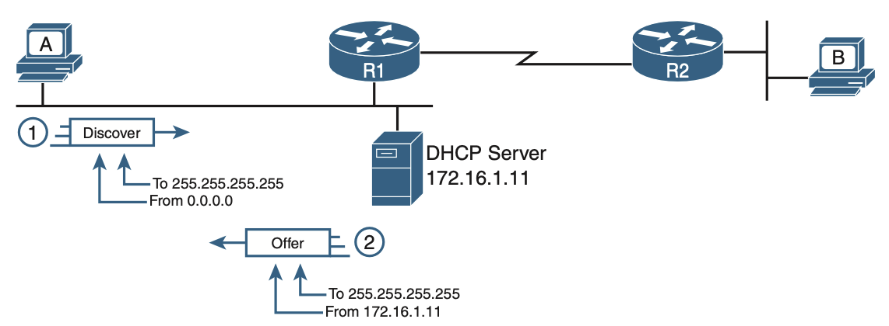

## Dynamic Host Configuration Protocol (DHCP)

Dynamic Host Configuration Protocol (DHCP) provides one of the most commonly used services in a TCP/IP network. The vast majority of hosts in a TCP/IP network are **user devices**, and the vast majority of user devices learn their IPv4 settings using DHCP.

### Why use DHCP?

Every device on a TCP/IP-based network must have a **unique unicast IP address** to access the network and its resources. Without DHCP, IP addresses for new computers or computers that are moved from one subnet to another must be configured manually; IP addresses for computers that are removed from the network must be manually reclaimed.

With DHCP, this entire process is automated and managed centrally. The DHCP server maintains a pool of IP addresses and leases an address to any DHCP-enabled client when it starts up on the network. Because the IP addresses are dynamic (leased) rather than static (permanently assigned), addresses no longer in use are automatically returned to the pool for reallocation.

### Benefits over manual configuration of IPv4 settings

Configuration of host IP settings sits in a DHCP server, with each client learning these settings using DHCP messages. Hence, host IP configuration is controlled by IT staff, rather than on local configuration on each host, resulting in fewer errors.

DHCP allows both the permanent assignment and temporary lease of host IP address. With these leases, the DHCP server can reclaim IP addresses when a device is removed from the network, making better use of the available addresses.

DHCP enables mobility. For example, every time a user moves to a new location with a tablet computer, the user’s device can connect to another wireless LAN, use DHCP to lease a new IP address in that LAN, and begin working on the new network. Without DHCP, the user would have to ask for information about the local network and configure settings manually, with more than a few users making mistakes.

## How DHCP works

As a DHCP client, the host begins with no IPv4 settings i.e. no IPv4 address, no mask, no default router, no DNS server IP addresses. However, a DHCP client does have knowledge of the DHCP protocol, so the client can use that protocol to:

1.  Discover a DHCP server
2.  Request to lease an IPv4 address

DHCP uses the following messages between client and server:

- Discover: Sent by the DHCP client to find a willing DHCP server
- Offer: Sent by a DHCP server to offer to lease to that client a specific IP address
- Request: Sent by the DHCP client to ask the server to lease the IPv4 address listed in the Offer message
- Acknowledgement: Sent by the DHCP server to assign the address and to list the mask, default router, and DNS server IP addresses

### Discover and Offer

As DHCP clients do not have an IP address initially, it makes use of two special IPv4 addresses that allow a host that has no IP address to send and receive messages on the local subnet:

- 0.0.0.0: An address reserved for use as a source IPv4 address for hosts that do not yet have an IP address
- 255.255.255.255: The local broadcast IP address; packets sent to this destination are broadcast on the local data link, but routers do not forward them

All hosts in the subnet receive the Offer message. However, the original Discover message lists a number called the client ID, which includes the host’s MAC address, that identifies the original host.

## DHCP and NAT in router

DHCP is strictly concerned with IP address assignment (can also be used for private IP addresses) and the communication of things such as DNS, default gateway,etc. Using DHCP, it reduces client configuration tasks and you have a centralized management. NAT is about translating private IP addresses to a public IP address for internet access.

DHCP and NAT can both be used at the time in a router. The router provides private IP addresses to all of your host in the network via DHCP. When one of this hosts want to send packets to the internet, this same router will translate the private IP address (previously assigned via DHCP) into a public address using NAT.

## Local DNS and DHCP

During DNS resolution, the client browser first contacts its local DNS server to perform DNS resolution. The local DNS server address is part of the client's network configuration or is assigned to the client via DHCP.
