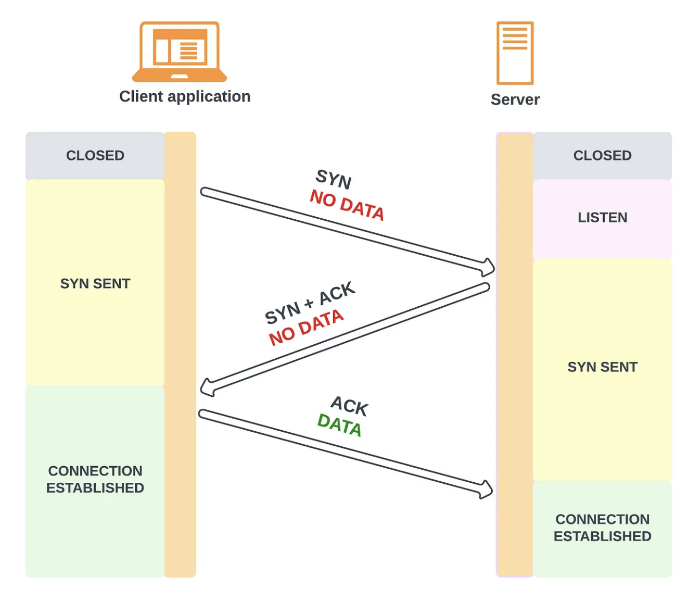

## TCP (Transmission Control Protocol)

TCP is defined as a connection-oriented communication protocol that allows computing devices and applications to send data via a network and verify its delivery. Relies on a **three-way handshake** (synchronization, synchronization acknowledgement and final acknowledgement).

TCP partitions a byte stream into discrete packets called segments. The segments are sequentially numbered, which allows the receiver to detect holes and duplicates. Every segment sent needs to be acknowledged by the receiver. When that doesn’t happen, a timer fires on the sending side, and the segment is retransmitted. To ensure that the data hasn’t been corrupted in transit, the receiver uses a checksum to verify the integrity of a delivered segment.

Task of TCP is to carry packets across the internet and ensure the successful delivery of messages and data across networks.

Before sending data, client and server must establish a connection. The server must actively listen for client requests whenever a connection is established.

However, while TCP is an instinctively reliable protocol, the feedback mechanisms also result in a more significant overhead size i.e. consumes more bandwidth.

TCP dynamically adapts the rate of data transfer to the available network capacity. When it is idling, it does not consume any bandwidth.

### Flow control

Flow control is a backoff mechanism implemented to prevent the sender from overwhelming the receiver. The receiver stores incoming TCP segments waiting to be processed by the process into a receive buffer.

The receiver also communicates back to the sender the size of the buffer whenever it acknowledges a segment. The sender avoids sending more data that can fit in the receiver’s buffer. TCP is rate-limiting on a connection level.

### Congestion control

TCP not only guards against overwhelming the receiver, but also against flooding the underlying network.

The sender estimates the available bandwidth of the underlying network empirically through measurements. The sender maintains a **congestion window**, which represents the total number of outstanding segments that can be sent without an acknowledgement from the receiver.

When a new connection is established, the size of the congestion window is set to a system default. Then, for every segment acknowledged, the window increases its size exponentially until reaching an upper limit. This means that we can’t use the network’s full capacity right after a connection is established. **The lower the round trip time (RTT) is, the quicker the sender can start utilizing the underlying network’s bandwidth**.

## UDP (User Datagram Protocol)

UDP is a message-oriented communication protocol that allows computing devices and applications to send data via a network without verifying its delivery, which is best suited to real-time communication and broadcast systems i.e. videoconferencing, live streaming.

Unlike TCP, UDP does not expose the abstraction of a byte stream to its clients. Clients can only send discrete packets (**datagrams**) with a limited size.

UDP is a good choice in situations where delayed data is worthless. For RTC, there is no point retransmitting lost packets; instead, the application must fill the missing packet's time slot with silence.

UDP enables continuous data transmission without acknowledging or confirming the connection. It is **connection-less** as no connection is established before communication occurs. Commonly referred to as the 'fire-and-forget' protocol.

UDP does not guarantee delivery of packets (reliability) as datagrams don't have sequence numbers are not acknowledged. Also, UDP doesn’t implement flow and congestion control.

## Multiplexing

Multiplexing relies on a concept called a **socket**, which consists of three things:

- An IP address
- Transport protocol
- Port number

## Differences

<table>
<tr>
<th>Factor</th>
<th>TCP</th>
<th>UDP</th>
</tr>
<tr>
<td>Connection type</td>
<td>Requires an established connection before transmitting data</td>
<td>No connection is needed to start and stop a data transfer</td>
</tr>
<tr>
<td>Data sequence</td>
<td>Can sequence data i.e. in a specific order</td>
<td>Cannot sequence or arrange data</td>
</tr>
<tr>
<td>Data retransmission</td>
<td>Can retransmit data if packets fail to arrive</td>
<td>No data retransmitting</td>
</tr>
<tr>
<td>Delivery</td>
<td>Guaranteed</td>
<td>Not guaranteed</td>
</tr>
<tr>
<td>Error checking</td>
<td>Thorough error-checking guarantees data arrives in its intended state, but consumes more bandwidth and processing cycles</td>
<td>Minimal error-checking</td>
</tr>
<tr>
<td>Broadcasting</td>
<td>Not supported</td>
<td>Supported</td>
</tr>
<tr>
<td>Speed</td>
<td>Slow</td>
<td>Fast</td>
</tr>
<tr>
<td>Multiplexing using ports</td>
<td>Not supported</td>
<td>Allows receiving hosts to choose the correct application for which the data is destined, based on port number</td>
</tr>
<tr>
<td>Flow control using windowing (sliding window)</td>
<td>Window concept lets the receiving host tell the sender how much data it can receive, to slow down or speed up</td>
<td>Not supported</td>
</tr>
</table>
