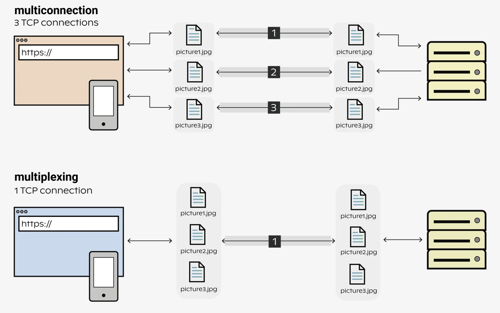

## HTTP/2

HTTP/2 specification was published in 2015 and improved on the HTTP/1.1 design. HTTP/2 relies on the same underlying protocol as HTTP1 which is TCP.

## Features

### Binary framing layer

HTTP messages defined in HTTP/1.1 and earlier are human-readable. In HTTP/2, these messages are embedded into a binary structure, allowing for **optimizations like compression of headers and multiplexing**.

HTTP/2 communication is divided into smaller messages and framed in binary format. Elements such as headers, methods, and verbs are encoded in the binary format during transmission.

### Header compression

HTTP2 uses a special compression algorithm called HPACK to make the headers smaller for multiple requests, thereby saving bandwidth.

### Multiplexing (parallel requests)

Multiplexing HTTP requests allows the usage of a single connection per client, meaning that a single connection between the client and the webserver can be used to serve **multiple requests asynchronously**, enabling the webserver to use less resources, thus support more users at the same time. Communication is **bidirectional** i.e. a single connection can send both requests and responses at the same time.

HTTP/2 uses a single connection to handle multiple requests and responses simultaneously by **dividing the connection into multiple streams**. Each stream:

- Is independent
- Assigned a unique identifier
- Can be processed in parallel as data is framed and interleaved within the connection

HTTP multiplexing saves resources by sharing the connection. However, as the connection is still a single TCP, it only makes sense to use if the connection can fully utilize the channel capacity i.e. **make use of the full bandwidth**.

### Stream prioritization

HTTP/2 enables clients to prioritize requests, allowing more critical resources to be fetched and rendered first.

Real-time communication with high performance is possible with HTTP/2 thanks to binary framing, whereby each stream is divided into frames that can be prioritized and run via a single TCP connection, reducing network utilization and processing load.

### Server push

With HTTP/2, servers can proactively push resources to the client's cache before they are requested, reducing latency and improving the overall user experience.

## Challenges

### Head-of-line blocking at TCP level

While HTTP/2 offers multiplexing which helps to solve HOLB at HTTP level, it does not resolve it at the **TCP level**. The TCP stack has to process packets and ensure all the bytes have been received in order for HTTP to consume them. If a packet at the head of the queue is lost, you have HOLB at the TCP layer.

TCP has some recovery means for HOLB, but at a high cost: several seconds in bad cases. There’s at least one round-trip involved in retransmitting the “head of line” piece. These lost round-trips have a devastating impact on mobile performance.
