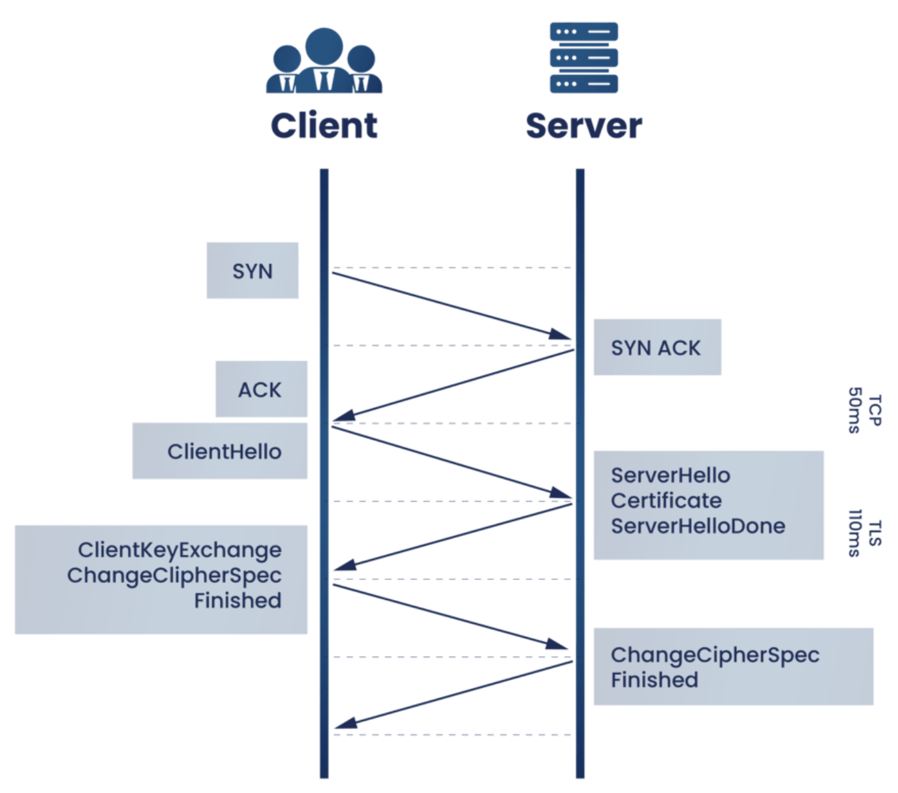

## TLS1.2 (Transport Layer Security)

An updated, more secure version of SSL (SSL successor). Asymmetrical cryptography requires significant computing resources; encrypting all information would be expensive. TLS gets around this by using it at beginning of communications session whereby the server and client agrees on single session key that will be used to encrypt packets from that point forward. Session/shared key is established using asymmetrical cryptography, and data is encrypted with shared key which uses symmetrical cryptography and is much less computationally intensive. Session keys are only used once.

### HMAC

TLS verifies the integrity of the data by calculating a message digest. A secure hash function is used to create a message authentication code (HMAC).

The TLS HMAC protects against both data corruption and tampering. While TCP does use a checksum to protect against data corruption, it is not 100% reliable as it fails to detect errors for every 16GB to 10TB transmitted.

### TLS handshake

A TLS handshake occurs whenever a user navigates to a website over HTTPS. Also happens whenever any other communications use HTTPS, including API calls and DNS over HTTPS queries.

During the course of a TLS handshake, the client and server together will perform the following:

- Specify which version of TLS (1.0, 1.2, 1.3) they will use
- Decide on which cipher suites they will use
- Authenticate the identity of the server via server's public key and the SSL certificate authority's digital signature
- Generate session keys in order to use symmetric encryption after the handshake is complete

The handshake process requires **two round trips** and is as follows:

1. **The 'client hello' message**: Client initiates the handshake by sending a "hello" message to the server. Message includes which TLS version the client supports, the cipher suites supported, and a string of random bytes known as the "client random"
2. **The 'server hello' message**: Server sends a message containing the server's SSL certificate, the server's chosen cipher suite, and the "server's random", another random string of bytes generated by the server
3. **Authentication**: Client verifies the server's SSL certificate with the certificate authority that issued it
4. **The premaster secret**: Client sends one more random string of bytes that is encrypted with the public key and can only be decrypted with the private key by the server (client gets the public key from the server's SSL certificate)
5. **Decryption**: Server decrypts the premaster secret with private key
6. **Session keys generated**: Both client and server generate session keys from the client random, server random, and the premaster secret
7. **Client is ready**: Client sends a "finished" message that is encrypted with a session key
8. **Server is ready**: Server sends a "finished" message encrypted with a session key
9. **Secure symmetric encryption achieved**: The handshake is completed, and subsequent communication uses the session keys

### TLS false start

TLS False Start means the client sends application data when sending "Change Cipher Spec Finished" (second stage of SSL handshake), and the server directly returns the application data (such as HTTP response) when TLS handshake is completed. In this way, application data can be sent before the handshake is fully completed.

After False Start is enabled, only **one RTT** is required during TLS handshake to start application data transfer. False Start means the client sends encrypted application data in advance, delivering a faster 1-RTT TLS handshake with no modification required for TLS protocol. Currently, False Start is enabled in most browsers by default.

## TLS1.3

TLS 1.3 does not support RSA, nor other cipher suites and parameters that are vulnerable to attack. It also shortens the TLS handshake, making a TLS 1.3 handshake both faster and more secure.

### Handshake

**One round trip** is required to establish secure connection.

1. **Client hello**: The client sends a client hello message with the protocol version, the client random, and a list of cipher suites. It also includes the parameters that will be used for calculating the premaster secret
2. **Server generates master secret**: At this point, the server has received the client random and the client's parameters and cipher suites. It already has the server random, since it can generate that on its own. Therefore, the server can create the master secret.
3. **Server hello and "Finished"**: The server hello includes the server’s certificate, digital signature, server random, and chosen cipher suite. As it already has the master secret, it also sends a "Finished" message.
4. **Final steps and client "Finished"**: Client verifies signature and certificate, generates master secret, and sends "Finished" message
5. **Secure symmetric encryption achieved**

### 0-RTT for session resumption

As a protocol feature baked into TLS 1.3, 0-RTT helps clients more quickly establish secure connections via key exchanges with the server.

If the client and the server have connected to each other before, they can each derive another shared secret from the first session, called the "resumption main secret." The server also sends the client something called a session ticket during this first session. The client can use this shared secret to send encrypted data to the server on its first message of the next session, along with that session ticket.

The 0-RTT process works in three steps:

1. **Client "Hello":** The client packages together 0-RTT data (from a previous session) with a "client hello" message to the server. Any sent data is encrypted and requires a shared secret for decryption.
2. **Server "Hello"**: Upon receiving the client's initial message, the server will verify the client's identity and then decrypt any received data. This requires the server to recognize the client and the encrypted data
3. **Server response**: The server sends a response to the client

Since the encrypted data arrives alongside the handshake, a network round trip is saved. However, organizations must still watch out for **targeted replay attacks**, in which attackers intercept original client messages and attempt to read them.
