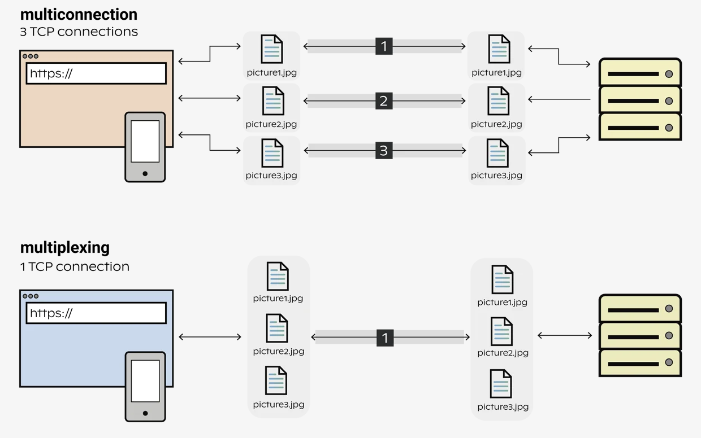

## HTTP/2

HTTP/2 specification was published in 2015 and improved on the HTTP/1.1 design.

## Features

### Binary framing layer

HTTP/2 communication is divided into smaller messages and framed in binary format. Unlike text-based HTTP/1.1, it makes sending and receiving messages compact and efficient. Elements such as headers, methods, and verbs are encoded in the binary format during transmission.

### Multiple parallel requests

While HTTP/1.1 allows for processing just one request at a time, HTTP/2 supports multiple calls via the same channel. Moreover, communication is bidirectional i.e. a single connection can send both requests and responses at the same time.

### Streaming

Real-time communication with high performance is possible with HTTP/2 thanks to binary framing, whereby each stream is divided into frames that can be prioritized and run via a single TCP connection, reducing network utilization and processing load.

### Multiplexing

Multiplexing HTTP requests allows the usage of a single connection per client, meaning that a single connection between the client and the webserver can be used to serve all requests asynchronously, enabling the webserver to use less resources, thus support more users at the same time.

HTTP multiplexing saves resources by sharing the connection. However, as the connection is still a single TCP, it only makes sense to use if the connection can fully utilize the channel capacity i.e. make use of the full bandwidth.

