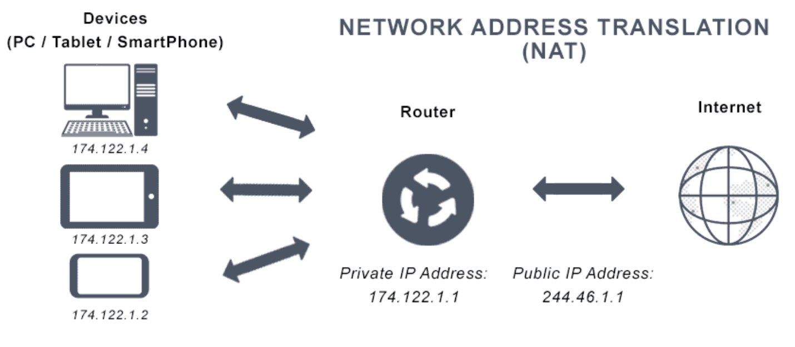

## Network Address Translation (NAT)

NAT is a process that enables one unique IP address to represent an entire group of computers. It maps multiple private addresses inside a local network to a public IP address before transferring the information onto the internet.

In NAT, a network device (router, NAT firewall), assigns a computer or computers inside a private network a public address. NAT allows the single device to act as an intermediary or agent between the local, private network and the public network. NAT’s main purpose is to **conserve the number of public IP addresses in use**, for both security and economic goals.

### How NAT works

Before NAT forwards packets between the networks it connects, it translates the private internal network addresses into legal, globally unique addresses.

If the packet keeps a private address, the receiving server won’t know where to send the information back to. This is because a private IP address cannot be routed onto the internet.

## NAT types

### Static NAT

When the local address is converted to a public one, this NAT chooses the same one. This means there will be a consistent public IP address associated with that router or NAT device.

### Dynamic NAT

Instead of choosing the same IP address every time, this NAT goes through a pool of public IP addresses. This results in the router or NAT device getting a different address each time the router translates the local address to a public address.

### Port Address Translation (PAT)

It’s a type of dynamic NAT, but it bands several local IP addresses to a singular public one. Organizations that want all their employees’ activity to use a singular IP address use a PAT, often under the supervision of a network administrator.
