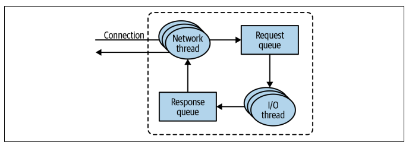
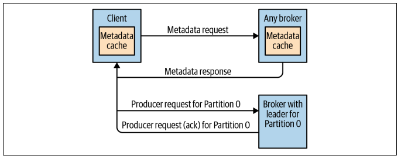

## Request processing

Most of what a Kafka broker does is to process requests sent to the partition leaders from clients, partition replicas, and the controller. Kafka has a binary protocol (over TCP) that specifies the format of the requests and how brokers respond to them.

Clients always initiate connections and send requests, and the broker processes the requests and responds to them. All requests sent to the broker from a specific client will be processed in the order in which they were received.

All requests have a standard header that includes:

- Request type or API key
- Request version
- Correlation ID
- Client ID

### Processing flow

- For each port the broker listens on, the broker runs an acceptor thread that creates a connection and hands it over to a processor/network thread for handling (number is configurable)
- Network threads are responsible for taking requests from client connections and placing them in a request queue, and picking up responses from a response queue and sending them back to clients
- Once requests are placed on the request queue, I/O threads are responsible for picking them up and processing them

### Metadata requests

- Most common types of client requests are Producer requests, Fetch requests, and Admin requests
- Both Produce and Fetch requests have to be sent to the leader replica of a partition; if a broker receives this request and the leader is on a different broker, it will throw an error
- Clients use a Metadata request (containing the list of topics they are interested in) that can be sent to any broker to know which broker to send their requests to
- Metadata response specifies which partitions exist in the topics, the replicas for each partition, and which replica is the leader

## Produce requests

A configuration parameter called acks is the number of brokers that need to acknowledge receiving the message before it is considered a successful write:

- acks=1 by just the leader
- acks=all by all in-sync replicas
- acks=0 without waiting for the broker to accept it

## Fetch requests

Clients send a request asking the broker to send messages from a list of topics, partitions and offsets. Clients can also specify a lower/upper boundary to how much data the broker can return for each partition. Setting the lower boundary helps to reduce CPU and network utilization when clients are reading from topics that are not seeing much traffic.

Not all the data that exists on the leader of the partition is available for clients to read. Most clients can only read messages that were written to all in-sync replicas. The reason for this behavior is that messages that are not replicated to enough replicas are considered 'unsafe'.
