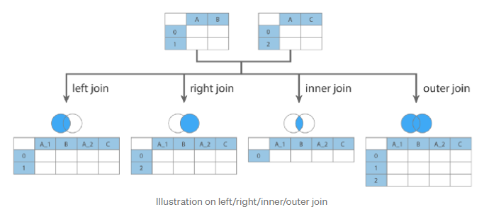

## Concatenate

Used for combining DataFrames across rows or columns (Default is to operate on columns).

Performs all of the heavy lifting along an axis while performing optional set logic (union or intersection) of the indexes on the other axes. Takes a list or dict of homogeneously-typed objects and concatenates them.

When concatenating multiple DataFrames, have the choice of how to handle the other axes. Default is taking the union with join="outer" as it results in zero information loss.

```py
frames = [df1,df2,df3]
pd.concat(frames)

# associate specific keys with each of the rows i.e. link to previous dataframe
pd.concat(frames, keys=["x", "y", "z"])

# resetting index
pd.concat([df1, df2], ignore_index=True)

# concatenate along the rows
pd.concat([df1, df2], axis=1)

# add multi-index
res = pd.concat([df1, df2], keys=['Year 1','Year 2'])
```


### Appending Rows to a DataFrame

Convert a series into a DataFrame and concat.

```py
s2 = pd.Series(["X0", "X1", "X2", "X3"], index=["A", "B", "C", "D"])
result = pd.concat([df1, s2.to_frame().T], ignore_index=True)
```

## Merge

Used for combining data on common columns or indices. Renames the common columns using the given suffix. Also provides three ways of flexible control over row-wise alignment.

Most flexible of the three operations. Can achieve both many-to-one and many-to-many joins. Various form of joins include left, right, inner and outer which is specified in the "how" argument.

```py
# on=COLUMN_NAME i.e. common column in both tables
pd.merge(left, right, row, on='key')

# aligning two tables using two different columns
# left_on=COLUMN_NAME, right_on=COLUMN_NAME

# alignment based on index
# left_index=True and right_index=True
```

## Join

An instance method that lives on your DataFrame. Used for combining data on a key column or an index. Allows the lowest level of control. Combines all the columns from the two tables, with the common columns renamed with the defined lsuffix and rsuffix. Performs a left join by default.

Under the hood, join() uses merge() but provides a more efficient way to join DataFrames than a fully specified merge() call. All columns are retained in the resulting DataFrame.

```py
df.join(df2, lsuffix='df1_col_name', rsuffix='df2_col_name')
```


