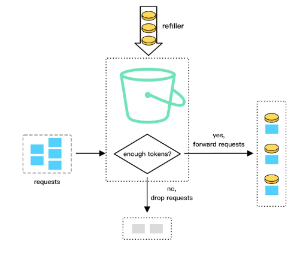
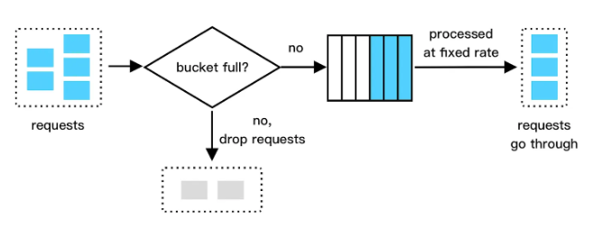

## Rate limiting

Rate limiting controls the rate at which users or services can access a resource. When the rate of requests exceeds the threshold defined by the rate limiter, the requests are throttled or blocked.

## Benefits

### Prevent resource starvation

Rate limiting helps prevent resource starvation caused by Denial of Service (DoS) attacks. Almost all APIs published by large tech companies enforce some form of rate limiting.

### Reduce cost

Rate limiting can help limit cost overruns by preventing the overuse of a resource. If a resource is overloaded by a high volume of requests, it may require additional resources or capacity to handle the load, which can incur additional costs.

### Prevent server overload

While rate limiting is vital in preventing DoS attacks, it also plays a pivotal role in general load balancing and service quality maintenance. High volumes of requests, not only from malicious sources but also from heavy usage, can overburden servers.

## Core concepts

### Limit

The limit defines the ceiling for allowable requests or actions within a designated time span. For example, we might allow a user to send no more than 100 messages every hour.

### Window

The window is the time period where the limit comes into play. It could be any length of time, whether it be an hour, a day, or a week.

### Identifier

The identifier is a unique attribute that differentiates between individual callers. A user ID or IP address is a common example.

### Blocking

Blocking takes place when requests exceeding the limit are denied access to the resource. It is commonly expressed as an error message such as HTTP status code 429 (Too Many Requests).

### Throttling

Throttling, by comparison, involves slowing down or delaying the requests that go beyond the limit. An example would be a video streaming service reducing the quality of the stream for users who have gone over their data cap.

### Shaping

Shaping allows requests that surpass the limit, but those requests are assigned **lower priority**. This ensures that users who abide by the limits receive quality service. For example, in a CDN, requests from users who have crossed their limits may be processed last, while those from normal users are prioritized.

## Algorithms

### Fixed window counter

The Fixed Window Counter algorithm divides the timeline into fixed-size time windows and assigns a counter for each window. Each request increments the counter by some value based on the relative cost of the request. Once the counter reaches the threshold, subsequent requests are blocked until the new time window begins.

### Sliding window counter

The Sliding Window Counter algorithm is a more efficient variation of the Sliding Window Log algorithm. It is a hybrid that combines the fixed window counter and sliding window log. Instead of maintaining a log of request timestamps, it calculates the weighted counter for the previous time window. When a new request arrives, the counter is adjusted based on the weight, and the request is allowed if the total is below the limit.

### Token bucket

The Token Bucket algorithm uses a "bucket" to hold tokens. The tokens represent the allowed number of requests. The bucket is initially filled with tokens, and tokens are added at a fixed rate over time. When a request arrives, it consumes a token from the bucket, and the request is allowed if there are enough tokens. If the bucket is full, extra tokens will overflow.

This algorithm allows for a smooth distribution of requests and can handle bursts of requests up to the bucket's capacity. It is memory efficient and relatively easy to implement.

### Leaky bucket

Requests enter the bucket and are processed at a fixed rate, simulating a "leak" in the bucket. If the bucket becomes full, new requests are discarded until there is space available. It is usually implemented with a FIFO queue. The algorithm works as follows:

- When a request arrives, the system checks if the queue is full
- If it is not full, the request is added to the queue
- Otherwise, the request is dropped
- Requests are pulled from the queue and processed at regular intervals

This algorithm is memory efficient given the limited queue size. Requests are processed at a fixed rate. It smooths out request bursts and enforces a consistent rate of processing. It is suitable for use cases where a stable outflow rate is required.

However, a burst of requests would fill up the queue with old requests, and if they are not processed in time, recent requests will be rate limit. It may result in longer waiting times for requests during high-traffic periods.

